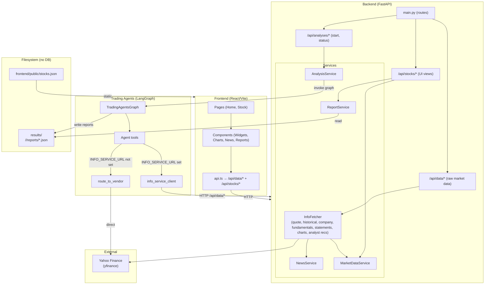

# Stock Dashboard & Trading Agents — System Architecture

High-level architecture: UI, Backend, Agents, and persistence (filesystem). No database; all persistence is file-based.

---

## Full system diagram (Mermaid)



---

## Data flow summary

| From | To | What |
|------|----|------|
| **UI** | Backend | Raw market data via `/api/data/*` (quote, news, fundamentals, statements, charts, historical, analyst recs). UI views via `/api/stocks/*` (widgets, full page). Start/status via `/api/analyses/*`. |
| **Backend** | Yahoo (yfinance) | All market data via InfoFetcher: quotes, news, company info, extended info, historical OHLCV, financial statements, financial charts, fundamentals, analyst recommendations. |
| **Backend** | FS | **Read**: `results/<TICKER>/<DATE>/reports/*.json` for report content and recommendations. |
| **Agents** (when `INFO_SERVICE_URL` set) | Backend | Data via `/api/data/*`: quote, news, stock-data, fundamentals, financial-statements, financial-charts, etc. |
| **Agents** (when `INFO_SERVICE_URL` not set) | Yahoo / vendors | Data via `route_to_vendor` (yfinance, Alpha Vantage, local, etc.). |
| **Backend** (analysis) | Agents | `AnalysisService` runs `TradingAgentsGraph`; graph uses tools that call backend `/api/data/*` (config sets `info_service_url`). |
| **Agents / CLI** | FS | **Write**: `results/<TICKER>/<DATE>/reports/*.json` (market, news, fundamentals, technical, sentiment, investment_plan, final_trade_decision, etc.). |

---

## API layers (Option A refactor)

| Path | Role | Endpoints |
|------|------|-----------|
| `/api/data/*` | **Canonical raw market data** (single source) | quote, news, company, extended-info, fundamentals, financial-statements, financial-charts, historical, stock-data, analyst-recommendations |
| `/api/stocks/*` | **UI views** (aggregated) | widgets, `{ticker}` (full page with reports, recommendations) |
| `/api/analyses/*` | **AI analysis** | start, status, WebSocket |

---

## Component roles

- **UI**: React/Vite app. Raw data from `/api/data/*`; UI views from `/api/stocks/*`. No direct Yahoo or agent calls.
- **Backend**: FastAPI. Serves raw data (`/api/data/*`), UI views (`/api/stocks/*`), analysis (`/api/analyses/start`). InfoFetcher fetches from Yahoo; ReportService reads from FS.
- **Agents**: LangGraph pipeline (analysts → researchers → risk → trader). Use either backend (`INFO_SERVICE_URL` → `/api/data/*`) or vendors directly (`route_to_vendor`). Write reports to FS (when run from CLI or backend analysis).
- **FS**: No database. `results/` holds per-ticker, per-date report JSON (metadata + markdown content); optional `stocks.json` for search. Backend reads; agents/CLI (or backend-driven graph) write.

---

## Optional: simplified one-page picture

```
                    ┌─────────────────────────────────────────────────────────┐
                    │                    Frontend (React)                      │
                    │  widgets, charts, news, reports, analysis start/status    │
                    └───────────────────────────┬─────────────────────────────┘
                                                 │ /api/data/*, /api/stocks/*, /api/analyses/*
                                                 ▼
┌──────────────┐    ┌─────────────────────────────────────────────────────────┐    ┌─────────────────┐
│   Yahoo      │◄───│              Backend (FastAPI)                            │───►│  results/       │
│  (yfinance)  │    │  • InfoFetcher (data) • /api/stocks/* (views)             │    │  <TICKER>/<DATE>│
└──────────────┘    │  • /api/data/* (raw market data for UI and agents)          │    │  /reports/*.json │
       ▲            └───────────────────────────┬───────────────────────────────┘    └────────▲────────┘
       │                                        │                                             │
       │    INFO_SERVICE_URL set                │ invoke graph                               │ read
       │    (optional)                           ▼                                             │
       │                ┌─────────────────────────────────────────────────────────┐           │
       └────────────────│  Trading Agents (LangGraph)                              │───────────┘
                        │  Tools → info_service_client or route_to_vendor         │  write
                        │  Analysts → Researchers → Risk → Trader                  │
                        └─────────────────────────────────────────────────────────┘
```
