# FlowDeck — System Architecture

High-level architecture: UI, Backend, AI Engine, cache infrastructure, and persisted report storage.

For the shared cache design, see [CACHE_LAYER.md](CACHE_LAYER.md).

---

## Full system diagram (Mermaid)

```mermaid
flowchart TB
    subgraph UI["Frontend (React/Vite)"]
        Pages["Pages (Home, Stock, Chat, Digest)"]
        Components["Components (Widgets, Charts, News, Reports)"]
        API_Client["api.ts → /api/data/* + /api/tickers/* + /api/chat/* + /api/digest/*"]
        Pages --> Components
        Components --> API_Client
    end

    subgraph Backend["Backend (FastAPI)"]
        direction TB
        Main["main.py (routes)"]
        API_Data["/api/data/* (raw market data)"]
        API_Stocks["/api/tickers/* (UI views)"]
        API_Analyses["/api/analyses/* (start, status, WebSocket)"]
        API_Chat["/api/chat/* (stream, sessions)"]
        API_Digest["/api/digest/* (generate, list)"]
        API_Other["/api/me /api/tokens /api/polymarket /api/share ..."]
        Main --> API_Data
        Main --> API_Stocks
        Main --> API_Analyses
        Main --> API_Chat
        Main --> API_Digest
        Main --> API_Other

        subgraph Services["Services"]
            InfoFetcher["InfoFetcher\n(quote, historical, company,\nfundamentals, statements,\ncharts, analyst recs)"]
            MarketData["MarketDataLayer"]
            ReportSvc["ReportService"]
            AnalysisSvc["AnalysisService"]
            DigestSvc["DigestService"]
            ChatTurnSvc["ChatTurnService\n(session persistence)"]
            CacheSvc["Shared SQLite Cache\n(raw data, derived outputs, runtime state)"]
        end

        API_Data --> InfoFetcher
        API_Stocks --> MarketData
        API_Stocks --> ReportSvc
        InfoFetcher --> MarketData
        API_Analyses --> AnalysisSvc
        API_Chat --> ChatTurnSvc
        API_Digest --> DigestSvc
        InfoFetcher --> CacheSvc
        MarketData --> CacheSvc
        AnalysisSvc --> CacheSvc
    end

    subgraph AIEngine["AI Engine (LangGraph / ai_engine/)"]

        subgraph ChatAgent["FlowDeck Chat Agent\n(ai_engine/agent/)"]
            direction TB
            FlowDeckAgent["FlowDeckAgent\n(graph.py)"]
            ChatGraph["Chat Graph\n(StateGraph)"]
            FlowDeckAgent --> ChatGraph
            ChatGraph --> PlanningNode["planning node\n(task complexity: simple / complex / long-horizon)"]
            PlanningNode --> PlanApproval["plan_approval node\n(long-horizon only)"]
            PlanningNode --> SkillRouter["skill_router node\n(LLM selects skill or ReAct)"]
            PlanApproval --> SkillRouter
            SkillRouter --> SkillNode["skill_node\n(deterministic multi-tool workflow)"]
            SkillRouter --> ReActLoop["ReAct loop\n(call_model ↔ tool_node)"]
            SkillNode --> LLMSynth["llm_synthesize node"]
            SkillNode --> ReActLoop
            LLMSynth --> ChatEnd["END"]
            ReActLoop --> ChatEnd
        end

        subgraph Skills["Built-in Skills\n(ai_engine/agent/skills/)"]
            StockDeepDive["stock_deep_dive"]
            PortfolioHealth["portfolio_health"]
            PortfolioPerf["portfolio_performance"]
            CompareStocks["compare_stocks"]
            CreateChart["chart_creation"]
        end

        subgraph AgentTools["Agent Tools\n(ai_engine/agent/tools/)"]
            direction LR
            T1["StockQuote"]
            T2["StockData / Historical\nIndicators / Multi-Historical"]
            T3["Fundamentals\nBalanceSheet / Cashflow\nIncomeStatement"]
            T4["AnalystRecommendations"]
            T5["News / GlobalNews"]
            T6["RedditSocial"]
            T7["InsiderTransactions\nInsiderSentiment"]
            T8["Events"]
            T9["PlatformReports\nHistoricalReportDates"]
            T10["WebSearch\nExecutePython"]
        end

        subgraph TradingAgents["TradingAgents Graph\n(ai_engine/tradingagents/)"]
            direction TB
            TAGraph["TradingAgentsGraph\n(trading_graph.py)"]
            Analysts["Analysts (parallel fan-out)\n• Market Analyst\n• Social Analyst\n• Fundamentals Analyst\n• Technical Analyst\n• SEC Analyst\n• Valuation Analyst"]
            Researchers["Researchers (debate loop)\n• Bull Researcher\n• Bear Researcher\n• Neutral Researcher"]
            ResearchMgr["Research Manager"]
            Trader["Trader"]
            TAGraph --> Analysts
            Analysts --> Researchers
            Researchers --> ResearchMgr
            ResearchMgr --> Trader
        end

        subgraph StockDeepResearch["Stock Deep Research\n(ai_engine/stock_deep_research/)"]
            direction TB
            SDRGraph["stock_researcher_graph\n(graph.py)"]
            WriteBrief["write_research_brief"]
            Supervisor["research_supervisor\n(StateGraph)"]
            Researcher["researcher subgraph\n(researcher ↔ researcher_tools)"]
            FinalReport["final_report_generation"]
            SDRGraph --> WriteBrief --> Supervisor --> FinalReport
            Supervisor --> Researcher
        end

        subgraph PortfolioDeepResearch["Portfolio Deep Research\n(ai_engine/portfolio_deep_research/)"]
            direction TB
            PDRGraph["portfolio_research_graph\n(graph.py)"]
            InterpretQ["interpret_query"]
            Plan["plan"]
            LoadReports["load_existing_reports"]
            RiskAnalyze["analyze_portfolio_risk"]
            Research["research"]
            ExtractEv["extract_evidence"]
            Synthesize["synthesize"]
            QA["qa"]
            Deliver["deliver"]
            PDRGraph --> InterpretQ --> Plan --> LoadReports --> RiskAnalyze --> Research --> ExtractEv --> Synthesize --> QA --> Deliver
        end

        subgraph BriefingAgent["Daily Brief / Stocks Discovery\n(ai_engine/briefing_agent/ + ai_engine/stocks_discovery/)"]
            direction LR
            DigestRunner["run_digest\n(briefing_agent/runner.py)"]
            FocusSelector["focus_selector agent"]
            TickerInterp["ticker_interpreter agent"]
            MarketInterp["market_interpreter agent"]
            NarrativeWriter["narrative_writer agent"]
            DigestRunner --> FocusSelector --> TickerInterp --> MarketInterp --> NarrativeWriter
        end

        SkillNode --> Skills
        Skills --> AgentTools
        ReActLoop --> AgentTools
    end

    subgraph External["External"]
        Yahoo["Yahoo Finance\n(yfinance)"]
        SEC["SEC EDGAR"]
        Reddit["Reddit API"]
        Tavily["Tavily / Web Search"]
        Polymarket["Polymarket API"]
    end

    subgraph DB["Persistence"]
        SQLiteDB["SQLite DB\n(users, sessions, chat messages,\nexecutions, reports, tokens, billing)"]
        Results["results/\n<TICKER>/<DATE>/reports/*.json"]
        StocksJson["frontend/public/stocks.json"]
    end

    API_Client -->|"HTTP"| Backend
    InfoFetcher --> Yahoo
    InfoFetcher --> SEC
    AgentTools -->|"via InfoFetcher\nor data_layer"| Yahoo
    AgentTools --> Reddit
    AgentTools --> Tavily
    AnalysisSvc -->|"invoke graph"| TradingAgents
    TradingAgents -->|"write reports"| Results
    ChatTurnSvc --> SQLiteDB
    DigestSvc -->|"invoke pipeline"| BriefingAgent
    API_Digest --> SQLiteDB
    API_Analyses --> SQLiteDB
    ReportSvc -->|"read"| Results
    StocksJson -->|"static"| UI
    Backend --> Polymarket
```



---

## Agent subsystems

### 1. FlowDeck Chat Agent (`ai_engine/agent/`)

The primary conversational agent that serves the `/api/chat/*` endpoints. Implemented as a
[`FlowDeckAgent`](../ai_engine/agent/graph.py) that compiles and reuses a LangGraph `StateGraph`.

**Graph nodes (in execution order):**

| Node | Role |
|------|------|
| `planning` | Classifies the request as `simple`, `complex`, or `long-horizon` using an LLM call. Long-horizon tasks produce a todo-list plan. |
| `plan_approval` | (long-horizon only) Presents the plan to the user and waits for approval before continuing. |
| `skill_router` | LLM reads available skill descriptions (from `SKILL.md` frontmatter) and decides which skill — if any — matches the user's intent; extracts arguments. |
| `skill_node` | Runs the matched skill's deterministic multi-tool workflow; injects the result into the system prompt context. |
| `llm_synthesize` | After a skill runs, calls the LLM once more to produce a polished final answer. |
| `call_model` | ReAct loop model node — the LLM decides which tool to call next. |
| `tool_node` | Executes the tool chosen by the LLM; result is fed back to `call_model`. |

**Routing:** `START → planning → [plan_approval →] skill_router → [skill_node → llm_synthesize | call_model ↔ tool_node] → END`

**State:** [`AgentState`](../ai_engine/agent/state.py) carries messages, user_id, db session, skill context, task type, planning phase, todo list, approval status, and discoveries.

**Skills** (`ai_engine/agent/skills/`) — each is a `BaseSkill` subclass with a `SKILL.md` file following the agentskills.io standard:

| Skill | Description |
|-------|-------------|
| `stock_deep_dive` | Deep single-stock analysis |
| `portfolio_health` | Portfolio allocation and health check |
| `portfolio_performance` | Portfolio return and performance metrics |
| `compare_stocks` | Side-by-side multi-stock comparison |
| `chart_creation` | Chart generation via `ExecutePython` |

**Tools** (`ai_engine/agent/tools/`) available to the ReAct loop and skills:

`StockQuote`, `StockData`, `HistoricalPrices`, `MultiHistoricalPrices`, `Indicators`, `Fundamentals`, `BalanceSheet`, `Cashflow`, `IncomeStatement`, `AnalystRecommendations`, `News`, `GlobalNews`, `RedditCompanySocial`, `InsiderTransactions`, `InsiderSentiment`, `Events`, `PlatformReports`, `HistoricalReportDates`, `WebSearch`, `ExecutePython`

---

### 2. TradingAgents Graph (`ai_engine/tradingagents/`)

Long-form research pipeline invoked by `AnalysisService` via `/api/analyses/start`. Produces per-ticker, per-date report JSON files to `results/<TICKER>/<DATE>/`.

#### Graph engineering perspective

This pipeline is a **LangGraph `StateGraph`** — a state machine mixing deterministic paths and agentic steps. It is **not a DAG**: the debate subgraph is a directed cycle (intentional). Key design points:

- **Agent steps** (analyst nodes): each analyst runs a full internal ReAct loop — it calls tools, inspects results, and iterates until it can produce a structured report. All of this happens inside a single graph node; there are no external tool nodes.
- **Dynamic fan-out via `Send`**: when `parallel_analysts=True` (default), a conditional edge from `START` uses LangGraph's `Send` primitive to dispatch all N analyst nodes concurrently. N equals `len(selected_analysts)`, which is not known until runtime — classic map-reduce fan-out.
- **Cyclic debate**: the Bull/Bear/Neutral subgraph is a directed cycle. Conditional edges route between researchers until `count ≥ 3 × max_debate_rounds`.
- **Model steps** (Research Manager, Trader): each makes a single structured LLM call (no tools).

**Graph flow:**

```
START
  └─► [Send fan-out — N analysts in parallel]
        • Market Analyst        (Agent step)
        • Social Analyst        (Agent step — news/catalysts + crowd sentiment)
        • Fundamentals Analyst  (Agent step)
        • Technical Analyst     (Agent step — optional)
        • SEC Analyst           (Agent step — optional, EDGAR filings)
        • Valuation Analyst     (Agent step — optional, multi-method fair value)
  └─► [barrier] → Bull Researcher ⇄ Bear Researcher ⇄ Neutral Researcher  (cyclic debate)
  └─► Research Manager  (Model step — issues investment_plan + BUY/SELL/HOLD)
  └─► Trader            (Model step — issues trader_investment_plan + TPS-YAML plan)
  └─► END
```

The debate loop continues until `ConditionalLogic.should_continue_debate` resolves to `Research Manager`. Signal extraction after the graph is a direct field read (`recommendation` → `trader_recommendation`), no second LLM call.

For the full node-by-node breakdown, see [AI_ANALYSIS_FLOW.md](AI_ANALYSIS_FLOW.md).

---

### 3. Stock Deep Research (`ai_engine/stock_deep_research/`)

Supervisor-researcher multi-agent graph for deep single-stock research. Used independently of the TradingAgents pipeline.

**Graph flow:**

```
START → write_research_brief → research_supervisor ─► final_report_generation → END
                                      │
                                      └─► researcher subgraph
                                            (researcher ↔ researcher_tools → compress_research)
```

---

### 4. Portfolio Deep Research (`ai_engine/portfolio_deep_research/`)

Sequential research pipeline for portfolio-level deep analysis.

**Graph flow:**

```
START → interpret_query → plan → load_existing_reports → analyze_portfolio_risk
      → research → extract_evidence → synthesize → qa → deliver → END
```

---

### 5. Daily Brief / Stocks Discovery (`ai_engine/briefing_agent/` + `ai_engine/stocks_discovery/`)

Non-graph sequential pipeline. Invoked by `DigestService` via `/api/digest/*`.

**Pipeline steps:**

```
build DigestContext (algorithmic: portfolio, market data, ranking, existing reports)
  → focus_selector agent  (picks priority tickers from user watchlist/portfolio)
  → ticker_interpreter agent  (per-priority ticker, if any)
  → market_interpreter agent
  → narrative_writer agent
  → persist to DB + return DigestResult
```

Supports `daily`, `weekly`, and `custom` span types.

---

## API layers

| Path | Role | Key endpoints |
|------|------|---------------|
| `/api/data/*` | **Canonical raw market data** | quote, news, company, extended-info, fundamentals, financial-statements, financial-charts, historical, stock-data, analyst-recommendations, edgar-filings, edgar-filing-content |
| `/api/tickers/*` | **UI views** (aggregated) | widgets, `{ticker}` full page with reports & recommendations |
| `/api/analyses/*` | **TradingAgents pipeline** | start, status, WebSocket progress |
| `/api/chat/*` | **Chat agent** | stream, sessions CRUD, turn status |
| `/api/digest/*` | **Daily brief pipeline** | generate, list by date, delete |
| `/api/me` | **User context** | profile, portfolio, watchlist |
| `/api/tokens/*` | **Token accounting** | balance, usage, top-up |
| `/api/polymarket/*` | **Prediction markets** | events, positions |
| `/api/share/*` | **Shareable links** | create, resolve |

---

## Data flow summary

| From | To | What |
|------|----|------|
| **UI** | Backend | Raw market data via `/api/data/*`; UI views via `/api/tickers/*`; analysis via `/api/analyses/*`; chat via `/api/chat/*`; brief via `/api/digest/*` |
| **Backend** | Yahoo (yfinance) | All market data via `InfoFetcher`: quotes, news, company info, historical OHLCV, financial statements, charts, fundamentals, analyst recommendations |
| **Backend** | SEC EDGAR | EDGAR service: company tickers → CIK, 10-K/10-Q filings, filing HTML; LLM extraction of risk factors, MD&A, competition |
| **Chat Agent** | Agent Tools | ReAct loop or skill calls tools (StockQuote, Financials, News, Reddit, Insider, WebSearch, ExecutePython, …) |
| **TradingAgents** | data_layer / InfoFetcher | Analysts fetch data internally (no separate tool node); data resolved via `data_layer` which routes through backend or vendors depending on `INFO_SERVICE_URL` |
| **Backend (analysis)** | TradingAgents | `AnalysisService` invokes `TradingAgentsGraph`; results written to `results/<TICKER>/<DATE>/reports/*.json` |
| **DigestService** | Briefing Agent | `run_digest()` builds context, runs LLM pipeline, persists to SQLite DB |
| **Backend** | SQLite DB | Chat sessions, messages, executions, users, tokens, billing |
| **Backend / Agents** | `results/` FS | Per-ticker per-date report JSON (market, news, fundamentals, sec, technical, valuation, sentiment, investment_plan, final_trade_decision) |

---

## Component roles

- **UI**: React/Vite app. Raw data from `/api/data/*`; UI views from `/api/tickers/*`; chat from `/api/chat/*`; digest from `/api/digest/*`. No direct Yahoo or agent calls.
- **Backend**: FastAPI. Serves all API surfaces. `InfoFetcher` → Yahoo/EDGAR; `AnalysisService` → TradingAgents; `DigestService` → Briefing Agent; `ChatTurnService` → FlowDeck Chat Agent.
- **FlowDeck Chat Agent**: Conversational ReAct + skills agent. `planning → skill_router → [skill_node | react_agent] → END`. Per-request state; graph compiled once and reused.
- **TradingAgents**: Parallel-analyst → 3-way-debate → research-manager → trader pipeline. Writes report JSON to `results/`. Invoked by `AnalysisService`.
- **Stock Deep Research**: Supervisor-researcher multi-agent for deep per-stock research. Separate from TradingAgents.
- **Portfolio Deep Research**: Sequential 9-step pipeline for portfolio-level deep analysis.
- **Briefing Agent / Stocks Discovery**: Sequential LLM pipeline for daily/weekly/custom market briefs. Persists to SQLite.
- **Persistence**: SQLite DB (users, chat, executions, billing); `results/` FS (per-ticker report JSON); optional `stocks.json` for search.
