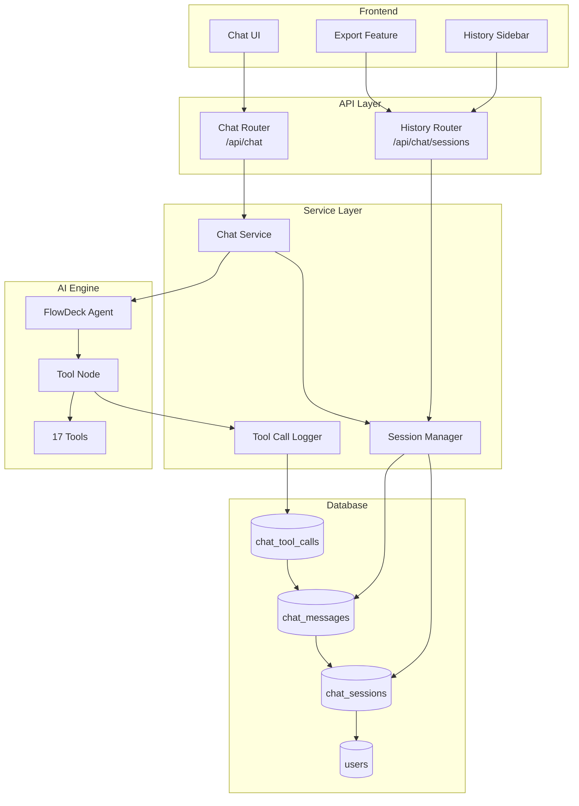
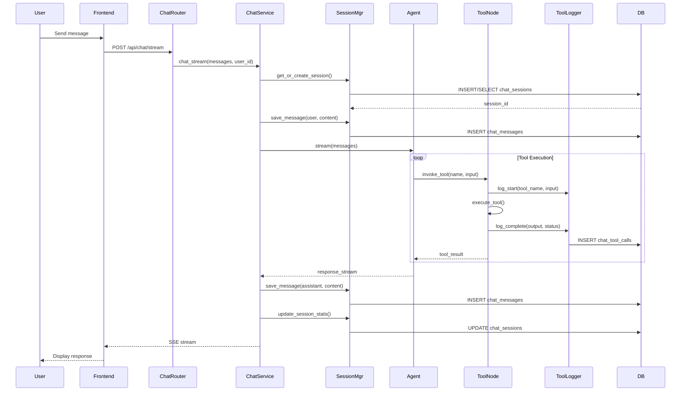
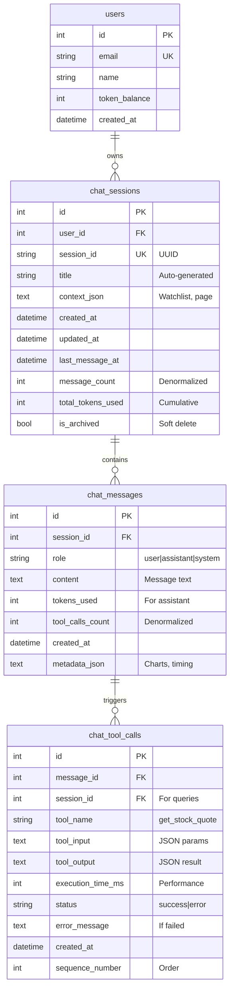
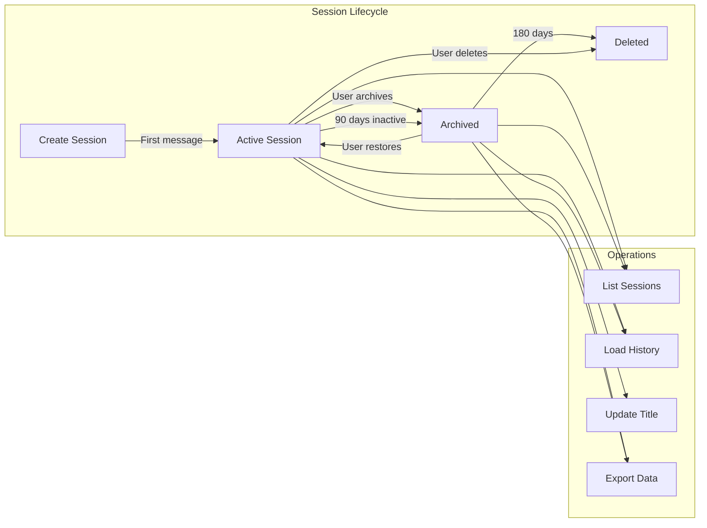
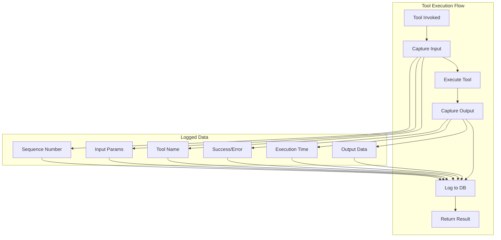
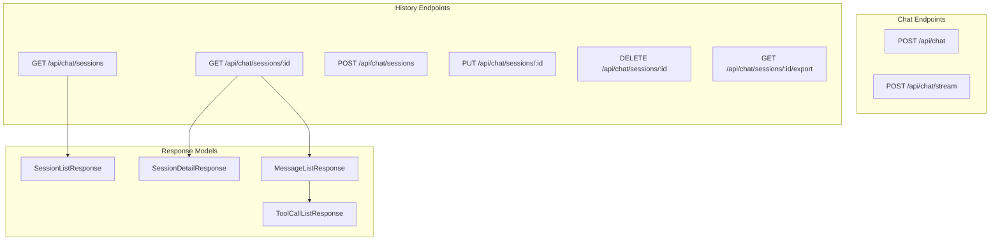
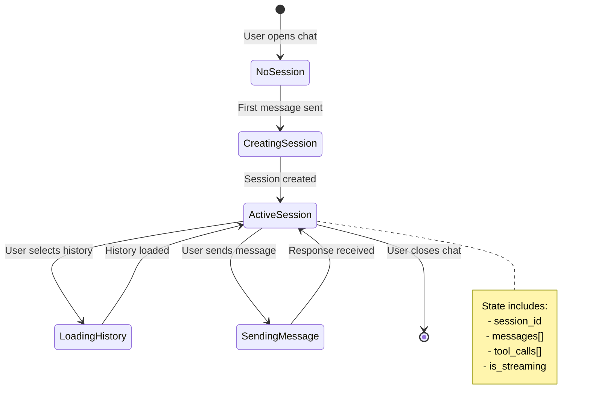
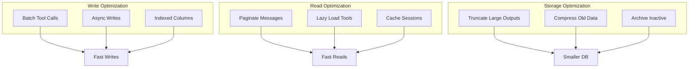
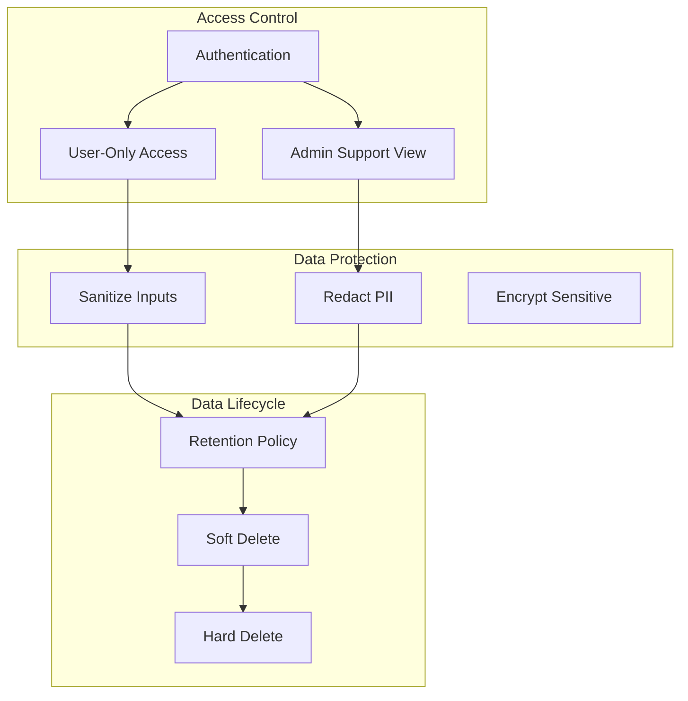
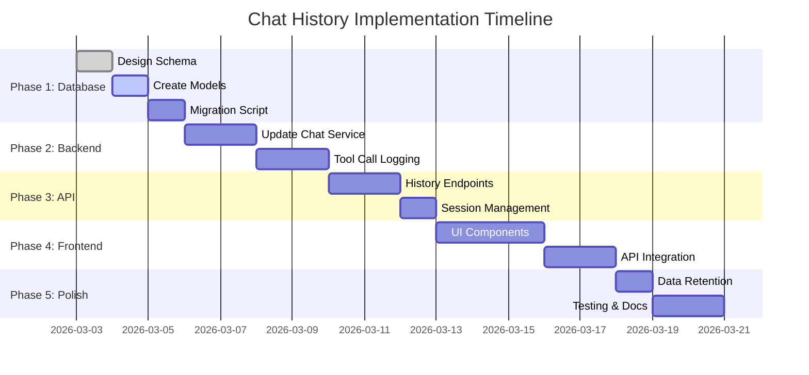

# Chat History Architecture

## System Architecture Overview



## Data Flow: Chat Message with Persistence



## Database Schema Relationships



## Component Interaction: Session Management



## Tool Call Logging Architecture



## API Endpoints Structure



## Frontend State Management



## Performance Optimization Strategy



## Security & Privacy Model



## Implementation Phases



## Key Design Decisions

### 1. Session-Based Architecture
- **Decision**: Use session-based model rather than flat message list
- **Rationale**: Enables conversation organization, context preservation, and better UX
- **Trade-off**: Slightly more complex schema, but much better user experience

### 2. Denormalized Counters
- **Decision**: Store `message_count` and `total_tokens_used` in sessions table
- **Rationale**: Faster queries for session lists, avoid expensive aggregations
- **Trade-off**: Need to maintain consistency on updates

### 3. Separate Tool Calls Table
- **Decision**: Store tool calls in separate table rather than in message metadata
- **Rationale**: Enables detailed querying, analytics, and debugging
- **Trade-off**: More storage, but much more valuable for analysis

### 4. Dual Foreign Keys in Tool Calls
- **Decision**: Reference both `message_id` and `session_id` in tool calls
- **Rationale**: Faster session-level queries without joining through messages
- **Trade-off**: Slight redundancy, but significant query performance gain

### 5. Soft Delete with Archive Flag
- **Decision**: Use `is_archived` flag rather than immediate deletion
- **Rationale**: Users can restore conversations, gradual cleanup
- **Trade-off**: Need cleanup job, but better user experience

## Monitoring & Observability

```mermaid
graph TB
    subgraph "Metrics"
        WriteLatency[Write Latency]
        ReadLatency[Read Latency]
        StorageSize[Storage Size]
        ErrorRate[Error Rate]
    end
    
    subgraph "Alerts"
        HighLatency[High Latency Alert]
        FailedWrites[Failed Writes Alert]
        StorageFull[Storage Full Alert]
    end
    
    subgraph "Dashboards"
        Usage[Usage Dashboard]
        Performance[Performance Dashboard]
        Errors[Error Dashboard]
    end
    
    WriteLatency --> HighLatency
    ReadLatency --> HighLatency
    ErrorRate --> FailedWrites
    StorageSize --> StorageFull
    
    WriteLatency --> Performance
    ReadLatency --> Performance
    StorageSize --> Usage
    ErrorRate --> Errors