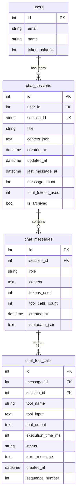

# Chat History Persistence Implementation Plan

## Overview

This document outlines the implementation plan for persisting full chat history in the FlowDeck database, including all user messages, assistant responses, tool calls with inputs/outputs, and metadata.

## Database Schema Design

### 1. ChatSession Table

Represents a conversation session between a user and the assistant.

```sql
CREATE TABLE chat_sessions (
    id INTEGER PRIMARY KEY AUTOINCREMENT,
    user_id INTEGER NOT NULL,
    session_id VARCHAR(64) UNIQUE NOT NULL,  -- UUID for session identification
    title VARCHAR(255),                       -- Auto-generated or user-provided title
    context_json TEXT,                        -- JSON: {"tickers": ["AAPL"], "page": "dashboard"}
    created_at DATETIME NOT NULL,
    updated_at DATETIME NOT NULL,
    last_message_at DATETIME,
    message_count INTEGER DEFAULT 0,
    total_tokens_used INTEGER DEFAULT 0,
    is_archived BOOLEAN DEFAULT FALSE,
    
    FOREIGN KEY (user_id) REFERENCES users(id) ON DELETE CASCADE,
    INDEX idx_chat_sessions_user_id (user_id),
    INDEX idx_chat_sessions_session_id (session_id),
    INDEX idx_chat_sessions_updated_at (updated_at)
);
```

**Fields:**
- `session_id`: UUID for client-side session tracking
- `title`: First user message (truncated) or custom title
- `context_json`: Stores context like watchlist tickers, page location
- `last_message_at`: For sorting recent conversations
- `message_count`: Quick count without querying messages table
- `total_tokens_used`: Cumulative token usage for the session
- `is_archived`: Soft delete for user organization

### 2. ChatMessage Table

Stores individual messages in a conversation.

```sql
CREATE TABLE chat_messages (
    id INTEGER PRIMARY KEY AUTOINCREMENT,
    session_id INTEGER NOT NULL,
    role VARCHAR(32) NOT NULL,               -- "user" | "assistant" | "system"
    content TEXT NOT NULL,
    tokens_used INTEGER DEFAULT 0,
    tool_calls_count INTEGER DEFAULT 0,
    created_at DATETIME NOT NULL,
    metadata_json TEXT,                      -- JSON: {"charts": [...], "thinking_time": 2.5}
    
    FOREIGN KEY (session_id) REFERENCES chat_sessions(id) ON DELETE CASCADE,
    INDEX idx_chat_messages_session_id (session_id),
    INDEX idx_chat_messages_created_at (created_at)
);
```

**Fields:**
- `role`: Message type (user/assistant/system)
- `content`: The actual message text
- `tokens_used`: Tokens consumed for this message (for assistant messages)
- `tool_calls_count`: Number of tools called for this message
- `metadata_json`: Additional data like charts, execution time, skill used

### 3. ChatToolCall Table

Stores detailed information about each tool invocation.

```sql
CREATE TABLE chat_tool_calls (
    id INTEGER PRIMARY KEY AUTOINCREMENT,
    message_id INTEGER NOT NULL,
    session_id INTEGER NOT NULL,
    tool_name VARCHAR(128) NOT NULL,
    tool_input TEXT NOT NULL,                -- JSON string of input parameters
    tool_output TEXT,                        -- JSON string or text output
    execution_time_ms INTEGER,               -- Execution duration in milliseconds
    status VARCHAR(32) NOT NULL,             -- "success" | "error" | "timeout"
    error_message TEXT,                      -- Error details if status = "error"
    created_at DATETIME NOT NULL,
    sequence_number INTEGER NOT NULL,        -- Order of execution within the message
    
    FOREIGN KEY (message_id) REFERENCES chat_messages(id) ON DELETE CASCADE,
    FOREIGN KEY (session_id) REFERENCES chat_sessions(id) ON DELETE CASCADE,
    INDEX idx_chat_tool_calls_message_id (message_id),
    INDEX idx_chat_tool_calls_session_id (session_id),
    INDEX idx_chat_tool_calls_tool_name (tool_name),
    INDEX idx_chat_tool_calls_created_at (created_at)
);
```

**Fields:**
- `tool_name`: Name of the tool (e.g., "get_stock_quote", "execute_python")
- `tool_input`: JSON-serialized input parameters
- `tool_output`: JSON-serialized or text output (truncated if too large)
- `execution_time_ms`: Performance tracking
- `status`: Success/failure tracking
- `sequence_number`: Order of tool calls within a message

## Entity Relationship Diagram



## Implementation Strategy

### Phase 1: Database Layer (Tasks 1-3)

1. **Create SQLAlchemy Models** (`backend/models/db_models.py`)
   - Add `ChatSession`, `ChatMessage`, `ChatToolCall` models
   - Define relationships and indexes
   - Add helper methods for common queries

2. **Create Migration Script** (`backend/scripts/migrate_chat_history.py`)
   - Create new tables with proper indexes
   - Idempotent (safe to run multiple times)
   - Follow existing migration pattern

3. **Update Database Initialization** (`backend/database.py`)
   - Import new models in `init_db()`
   - Ensure tables are created on startup

### Phase 2: Service Layer (Tasks 4-5)

1. **Update ChatService** (`backend/services/chat_service.py`)
   - Add session management methods:
     - `create_session(user_id, context) -> session_id`
     - `get_or_create_session(session_id, user_id, context)`
     - `save_message(session_id, role, content, metadata)`
     - `save_tool_call(message_id, tool_name, input, output, status)`
   
2. **Integrate with Existing Chat Flow**
   - Modify `chat()` method to persist messages
   - Modify `chat_stream()` to persist in real-time
   - Capture tool calls from FlowDeckAgent execution
   - Update session statistics (message_count, total_tokens_used)

3. **Tool Call Instrumentation**
   - Wrap tool execution in `ai_engine/agent/graph.py`
   - Capture input, output, timing, and status
   - Pass db session through RunnableConfig
   - Log to `chat_tool_calls` table

### Phase 3: API Layer (Tasks 6-7)

1. **Create Chat History Router** (`backend/routers/chat_history.py`)
   ```python
   GET  /api/chat/sessions              # List user's chat sessions
   GET  /api/chat/sessions/{session_id} # Get full conversation history
   POST /api/chat/sessions              # Create new session
   PUT  /api/chat/sessions/{session_id} # Update session (title, archive)
   DELETE /api/chat/sessions/{session_id} # Delete session
   GET  /api/chat/sessions/{session_id}/export # Export as JSON/markdown
   ```

2. **Response Models**
   ```python
   class ChatSessionResponse:
       session_id: str
       title: str
       created_at: datetime
       updated_at: datetime
       message_count: int
       total_tokens_used: int
       is_archived: bool
   
   class ChatMessageResponse:
       role: str
       content: str
       tokens_used: int
       tool_calls_count: int
       created_at: datetime
       tool_calls: List[ToolCallResponse]
   
   class ToolCallResponse:
       tool_name: str
       tool_input: dict
       tool_output: str
       execution_time_ms: int
       status: str
   ```

### Phase 4: Frontend Integration (Task 8)

1. **Chat History UI Components**
   - Session list sidebar (recent conversations)
   - Session detail view (full conversation)
   - Tool call expansion (show/hide details)
   - Export functionality

2. **API Integration** (`frontend/src/services/chatApi.ts`)
   - Fetch session list
   - Load conversation history
   - Create/update/delete sessions
   - Export conversations

3. **State Management**
   - Track current session_id
   - Load history on session selection
   - Auto-create session on first message
   - Update session list on new messages

### Phase 5: Data Management (Task 9)

1. **Retention Policies**
   - Auto-archive sessions older than 90 days
   - Delete archived sessions after 180 days
   - Configurable per user tier (free vs paid)

2. **Cleanup Service** (`backend/services/chat_cleanup_service.py`)
   - Scheduled job to enforce retention
   - Truncate large tool outputs (>10KB)
   - Aggregate old sessions for analytics

3. **Storage Optimization**
   - Compress old message content
   - Index optimization for queries
   - Pagination for large conversations

### Phase 6: Documentation (Task 10)

1. **User Documentation**
   - How to access chat history
   - Export and search features
   - Privacy and data retention

2. **Developer Documentation**
   - Database schema reference
   - API endpoint documentation
   - Migration guide

## Data Flow

### Chat Request Flow (with Persistence)

```
1. User sends message
   ↓
2. Router receives request with optional session_id
   ↓
3. ChatService.chat_stream():
   a. Get or create session
   b. Save user message to DB
   c. Call FlowDeckAgent.stream()
   ↓
4. FlowDeckAgent executes:
   a. Tool calls → Save to chat_tool_calls
   b. Generate response
   ↓
5. ChatService receives response:
   a. Save assistant message to DB
   b. Update session statistics
   c. Stream to client
   ↓
6. Client receives response with session_id
```

### Tool Call Logging Flow

```
1. ToolNode.invoke() called
   ↓
2. Wrapper captures:
   - tool_name
   - input parameters
   - start_time
   ↓
3. Execute tool
   ↓
4. Wrapper captures:
   - output
   - end_time
   - status (success/error)
   ↓
5. Save to chat_tool_calls table
   ↓
6. Return result to agent
```

## Performance Considerations

1. **Write Performance**
   - Batch insert tool calls after message completion
   - Use async writes where possible
   - Index on frequently queried columns

2. **Read Performance**
   - Paginate message history (50 messages per page)
   - Lazy-load tool call details
   - Cache recent sessions in memory

3. **Storage Management**
   - Truncate tool outputs >10KB (store summary)
   - Compress old conversations
   - Archive inactive sessions

## Privacy & Security

1. **Data Access**
   - Users can only access their own sessions
   - Admin can view for support purposes
   - API key authentication for programmatic access

2. **Data Deletion**
   - Cascade delete on user deletion
   - Soft delete with archive flag
   - Hard delete after retention period

3. **Sensitive Data**
   - Don't log API keys or passwords in tool inputs
   - Sanitize financial account numbers
   - Redact PII in exports

## Testing Strategy

1. **Unit Tests**
   - Model creation and relationships
   - Service methods (CRUD operations)
   - Tool call logging

2. **Integration Tests**
   - End-to-end chat flow with persistence
   - Session management
   - Tool call capture

3. **Performance Tests**
   - Large conversation handling
   - Concurrent session creation
   - Query performance with 10K+ messages

## Rollout Plan

1. **Phase 1**: Deploy database schema (migration)
2. **Phase 2**: Enable persistence in backend (feature flag)
3. **Phase 3**: Test with internal users
4. **Phase 4**: Deploy API endpoints
5. **Phase 5**: Release frontend UI
6. **Phase 6**: Enable for all users

## Success Metrics

- 100% of chat messages persisted successfully
- <100ms overhead for message persistence
- <500ms to load conversation history
- Zero data loss incidents
- User satisfaction with history feature

## Future Enhancements

1. **Search & Analytics**
   - Full-text search across conversations
   - Topic clustering and insights
   - Usage analytics dashboard

2. **Collaboration**
   - Share conversations with other users
   - Team workspaces
   - Conversation templates

3. **AI Features**
   - Conversation summarization
   - Automatic title generation
   - Smart suggestions based on history

## References

- Existing database models: [`backend/models/db_models.py`](../backend/models/db_models.py)
- Chat service: [`backend/services/chat_service.py`](../backend/services/chat_service.py)
- Chat router: [`backend/routers/chat.py`](../backend/routers/chat.py)
- Agent graph: [`ai_engine/agent/graph.py`](../ai_engine/agent/graph.py)
- Migration guide: [`docs/DATABASE_MIGRATION.md`](DATABASE_MIGRATION.md)