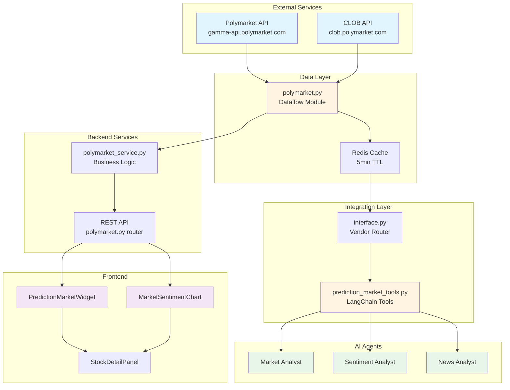
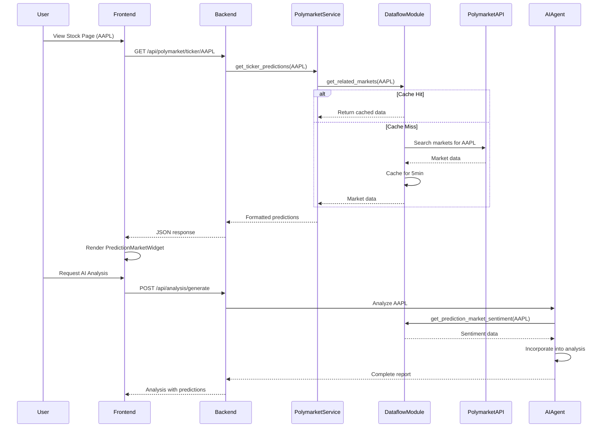
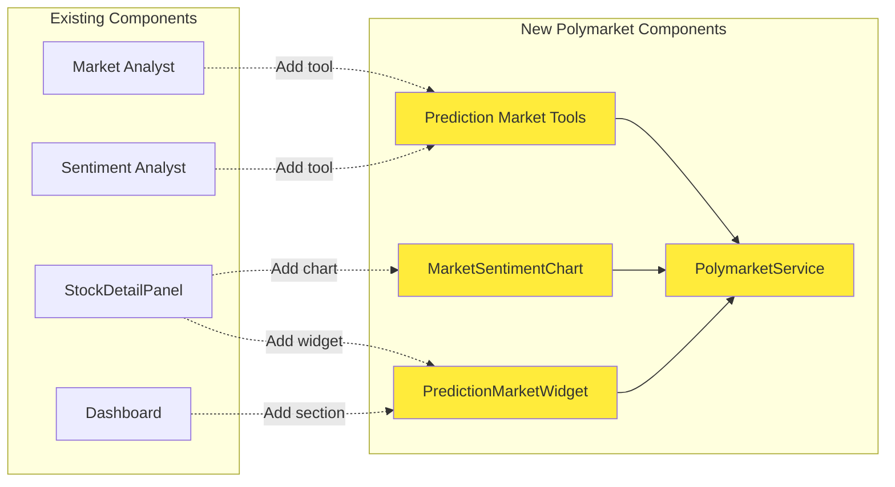
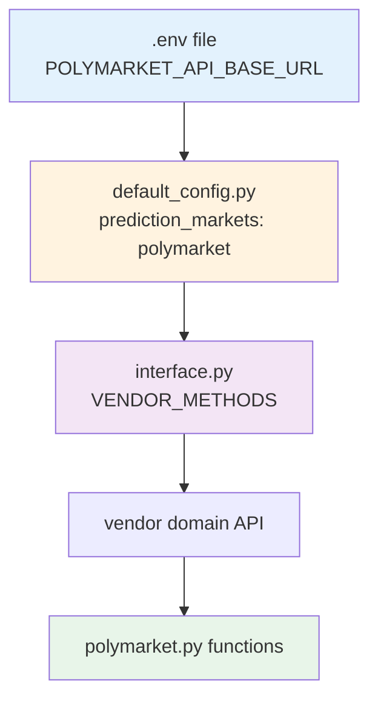
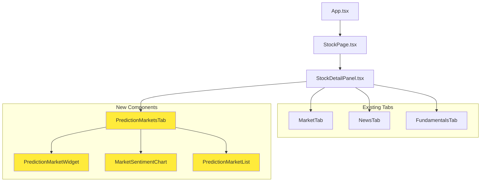
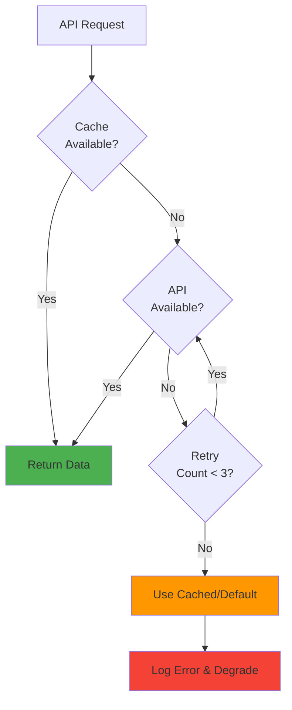
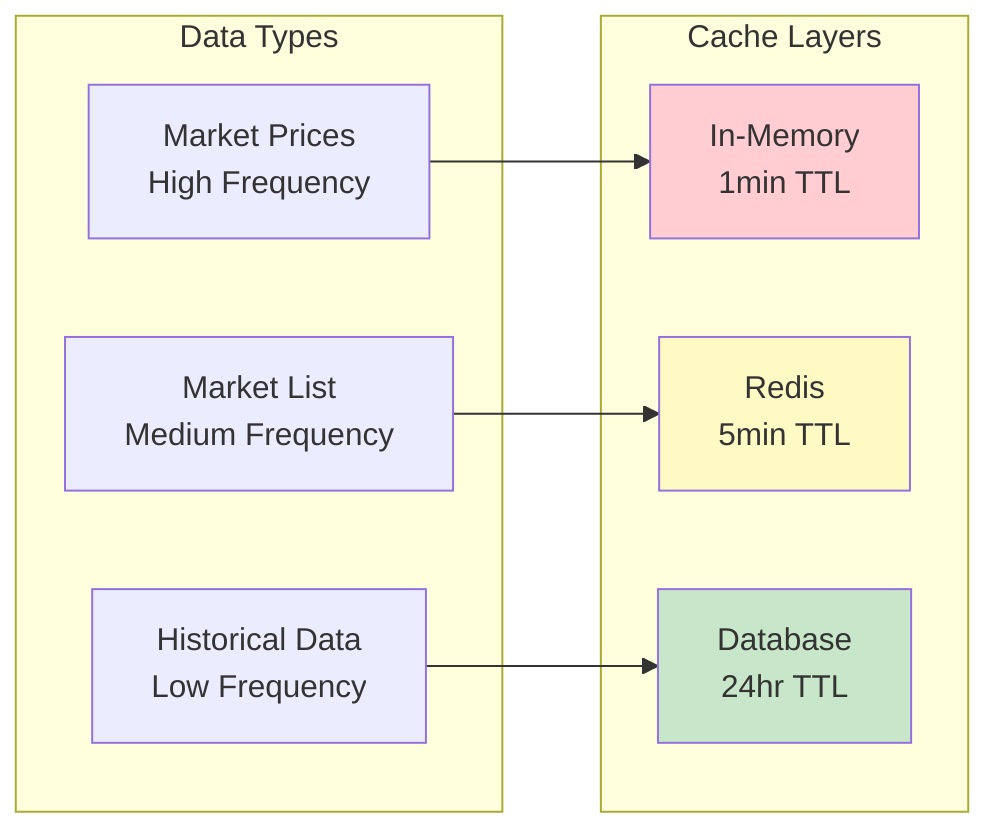
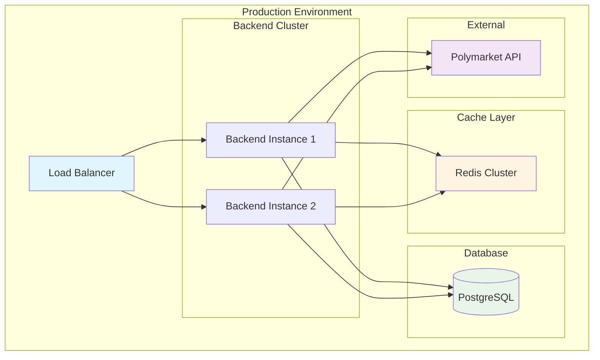
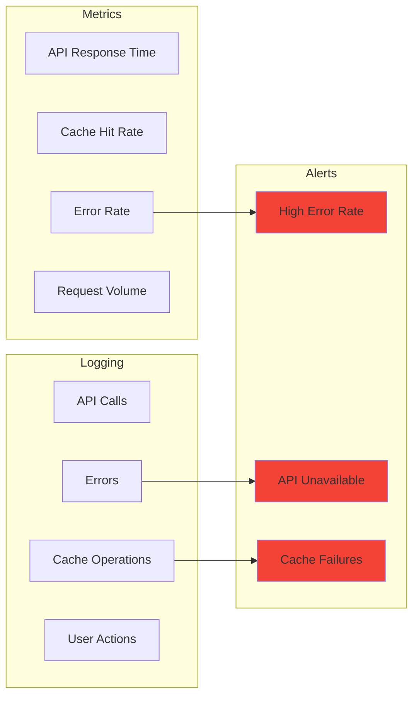

# Polymarket Integration Architecture

## System Architecture Diagram



## Data Flow Sequence



## Component Integration Points



## Configuration Flow



## Agent Tool Integration

```mermaid
graph TB
    subgraph "Market Analyst Tools"
        T1[get_stock_data]
        T2[get_stock_quote]
        T3[get_indicators]
        T4[get_prediction_market_sentiment]
        T5[get_market_implied_probabilities]
    end

    subgraph "Tool Implementation"
        T4 --> PMF1[get_market_sentiment]
        T5 --> PMF2[get_related_markets]
        T5 --> PMF3[search_markets]
    end

    subgraph "Polymarket API"
        PMF1 --> API1[/markets/search]
        PMF2 --> API2[/markets]
        PMF3 --> API3[/markets/search]
    end

    style T4 fill:#ffeb3b
    style T5 fill:#ffeb3b
    style PMF1 fill:#fff4e1
    style PMF2 fill:#fff4e1
    style PMF3 fill:#fff4e1
```

## Frontend Component Hierarchy



## Error Handling Flow



## Caching Strategy



## Deployment Architecture



## Key Design Principles

### 1. Modularity
- Polymarket integration is a separate module
- Can be enabled/disabled via configuration
- No breaking changes to existing functionality

### 2. Performance
- Multi-layer caching strategy
- Async API calls
- Batch requests where possible
- Lazy loading in frontend

### 3. Reliability
- Graceful degradation if API unavailable
- Fallback to cached data
- Comprehensive error handling
- Rate limiting and backoff

### 4. Extensibility
- Easy to add new prediction market sources
- Pluggable architecture
- Clear interfaces between components

### 5. User Experience
- Clear data presentation
- Tooltips and explanations
- Visual indicators for data freshness
- Responsive design

## Technology Stack

### Backend
- **Python 3.11+**: Core language
- **FastAPI**: REST API framework
- **aiohttp**: Async HTTP client
- **Redis**: Caching layer
- **SQLAlchemy**: Database ORM

### AI/ML
- **LangChain**: Agent framework
- **LangGraph**: Multi-agent orchestration
- **OpenAI/Anthropic**: LLM providers

### Frontend
- **React 18**: UI framework
- **TypeScript**: Type safety
- **Vite**: Build tool
- **Recharts**: Data visualization

### Infrastructure
- **Docker**: Containerization
- **Nginx**: Reverse proxy
- **systemd**: Process management

## Security Considerations

1. **API Key Management**: No keys required for public Polymarket API
2. **Rate Limiting**: Implement client-side rate limiting
3. **Data Validation**: Validate all API responses
4. **Error Sanitization**: Don't expose internal errors to users
5. **CORS**: Proper CORS configuration for API endpoints

## Monitoring & Observability



## Next Steps

1. Review and approve this architecture
2. Set up development environment
3. Begin Phase 1 implementation (Core Infrastructure)
4. Iterate based on feedback and testing
