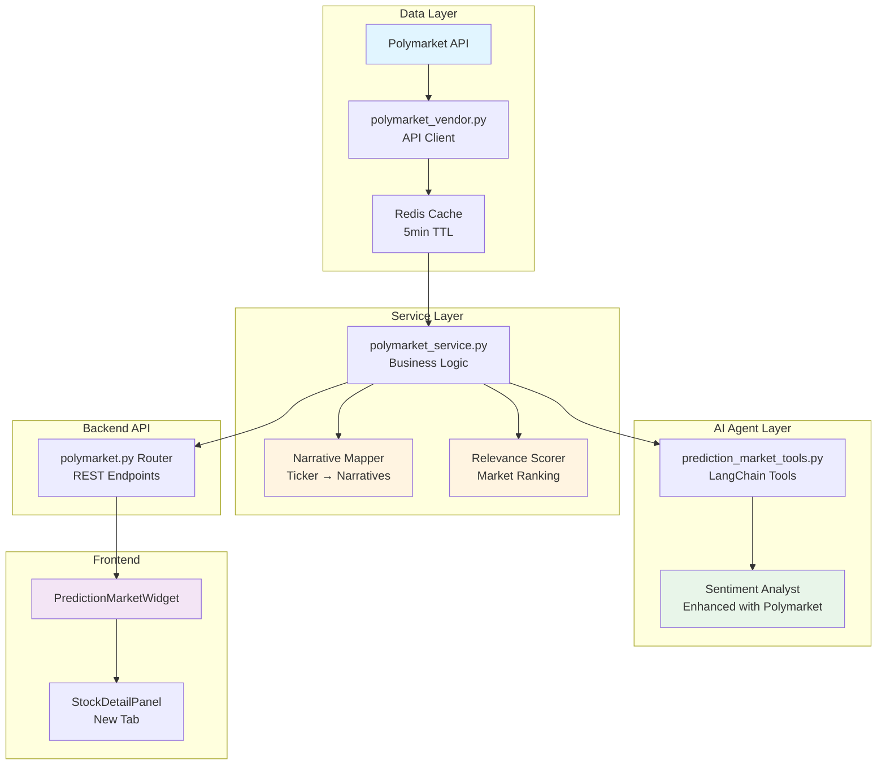

# Polymarket Integration Implementation Plan

## Executive Summary

This plan integrates Polymarket prediction market data into FlowDeck to enhance public sentiment analysis. Currently, FlowDeck uses Reddit as the sole source for public sentiment. Polymarket will add **money-backed belief signals** that complement social media sentiment with real financial stakes.

## Strategic Approach: Narrative-Based Retrieval

Following the AI recommendation, we'll use a **narrative clustering approach** rather than simple keyword matching:

```
Ticker → Narratives → Markets → Sentiment
```

### Why This Matters

For a ticker like TSLA:
- ❌ **Simple approach**: Search "Tesla" → get direct mentions only
- ✅ **Narrative approach**: Map to narratives (EV adoption, China economy, interest rates, AI hype) → find all relevant markets → aggregate sentiment

This captures **indirect drivers** that affect stock performance but don't mention the ticker directly.

## Architecture Overview



## Implementation Phases

### Phase 1: Backend Data Layer (Week 1)

#### 1.1 Polymarket Vendor Module
**File**: `backend/data_layer/vendors/polymarket_vendor.py`

**Core Functions**:
```python
def fetch_markets(
    query: Optional[str] = None,
    category: Optional[str] = None,
    active: bool = True,
    limit: int = 100
) -> List[Dict]:
    """Fetch markets from Polymarket API with filtering."""

def get_market_details(market_id: str) -> Dict:
    """Get detailed information about a specific market."""

def get_market_prices(market_id: str) -> Dict:
    """Get current prices and implied probabilities."""

def search_markets_by_embedding(
    query_embedding: List[float],
    top_k: int = 10
) -> List[Dict]:
    """Semantic search using embeddings (future enhancement)."""
```

**Key Features**:
- HTTP client with retry logic and exponential backoff
- Response caching (5-minute TTL for prices, 1-hour for market lists)
- Error handling with graceful degradation
- Rate limiting protection

#### 1.2 Narrative Mapping System
**File**: `backend/services/polymarket_narrative_mapper.py`

**Narrative Categories**:
```python
NARRATIVE_TEMPLATES = {
    "macro_liquidity": [
        "Fed rate", "interest rates", "monetary policy",
        "inflation", "CPI", "rate cuts", "rate hikes"
    ],
    "sector_momentum": {
        "tech": ["AI", "tech stocks", "semiconductor", "cloud computing"],
        "energy": ["oil prices", "renewable energy", "EV adoption"],
        "finance": ["banking", "fintech", "crypto regulation"]
    },
    "economic_indicators": [
        "GDP", "unemployment", "recession", "economic growth",
        "consumer spending", "retail sales"
    ],
    "geopolitical": [
        "China economy", "trade war", "sanctions",
        "geopolitical tensions", "supply chain"
    ],
    "company_specific": [
        "{ticker}", "{company_name}", "earnings",
        "{ticker} stock", "{ticker} price"
    ]
}

def map_ticker_to_narratives(
    ticker: str,
    company_info: Dict
) -> List[str]:
    """
    Map a ticker to relevant narrative categories.
    
    Returns prioritized list of search queries for Polymarket.
    """
```

**Example Output for NVDA**:
```python
[
    "AI stocks performance",
    "semiconductor industry",
    "tech sector outlook",
    "Fed rate cuts",
    "China economy",
    "Nvidia earnings",
    "GPU demand"
]
```

#### 1.3 Market Relevance Scorer
**File**: `backend/services/polymarket_relevance_scorer.py`

**Scoring Algorithm**:
```python
def score_market_relevance(
    market: Dict,
    ticker: str,
    narratives: List[str]
) -> float:
    """
    Score market relevance (0-1) based on multiple factors.
    
    Factors:
    1. Keyword match (0-0.3): Direct ticker/company mentions
    2. Narrative alignment (0-0.3): Matches narrative categories
    3. Liquidity weight (0-0.2): log(volume) normalized
    4. Time relevance (0-0.1): Near-term markets preferred
    5. Resolution clarity (0-0.1): Clear, measurable outcomes
    """
    
    score = 0.0
    
    # 1. Keyword matching
    score += keyword_match_score(market, ticker)
    
    # 2. Narrative alignment
    score += narrative_alignment_score(market, narratives)
    
    # 3. Liquidity (very important)
    score += liquidity_score(market)
    
    # 4. Time relevance
    score += time_relevance_score(market)
    
    # 5. Resolution clarity
    score += clarity_score(market)
    
    return min(score, 1.0)
```

**Filtering Rules**:
- Minimum volume: $1,000
- Minimum liquidity: $500
- Active markets only
- Clear resolution criteria

### Phase 2: Service Layer (Week 2)

#### 2.1 Polymarket Service
**File**: `backend/services/polymarket_service.py`

**Core Methods**:
```python
class PolymarketService:
    def get_ticker_sentiment(
        self,
        ticker: str,
        company_info: Dict
    ) -> Dict:
        """
        Get aggregated Polymarket sentiment for a ticker.
        
        Returns:
        {
            "overall_sentiment": 0.68,  # 0-1 scale
            "confidence": 0.85,  # Based on volume
            "trend": "bullish",  # bullish/neutral/bearish
            "narratives": {
                "ai_momentum": {"sentiment": 0.78, "confidence": 0.9},
                "macro_liquidity": {"sentiment": 0.52, "confidence": 0.7}
            },
            "top_markets": [...]  # Top 5 most relevant markets
        }
        """
        
    def get_relevant_markets(
        self,
        ticker: str,
        limit: int = 10
    ) -> List[Dict]:
        """Get ranked list of relevant markets."""
        
    def get_market_sentiment_timeseries(
        self,
        market_id: str,
        days: int = 30
    ) -> List[Dict]:
        """Get historical probability data for trending."""
```

**Aggregation Logic**:
```python
def aggregate_sentiment(markets: List[Dict]) -> float:
    """
    Weighted average of market probabilities.
    
    Weight = log(volume) * relevance_score * time_decay
    """
    total_weight = 0
    weighted_sum = 0
    
    for market in markets:
        weight = (
            math.log10(market['volume'] + 1) *
            market['relevance_score'] *
            time_decay_factor(market['end_date'])
        )
        weighted_sum += market['probability'] * weight
        total_weight += weight
    
    return weighted_sum / total_weight if total_weight > 0 else 0.5
```

#### 2.2 Backend API Router
**File**: `backend/routers/polymarket.py`

**Endpoints**:
```python
@router.get("/api/polymarket/ticker/{ticker}")
async def get_ticker_predictions(
    ticker: str,
    current_user: User = Depends(get_current_user_optional)
):
    """Get Polymarket sentiment and relevant markets for a ticker."""

@router.get("/api/polymarket/markets/trending")
async def get_trending_markets(
    category: str = "finance",
    limit: int = 20
):
    """Get trending prediction markets by volume."""

@router.get("/api/polymarket/market/{market_id}")
async def get_market_details(market_id: str):
    """Get detailed information about a specific market."""

@router.get("/api/polymarket/market/{market_id}/history")
async def get_market_history(
    market_id: str,
    days: int = 30
):
    """Get historical probability data for a market."""
```

### Phase 3: AI Agent Integration (Week 2-3)

#### 3.1 Prediction Market Tools
**File**: `ai_engine/tradingagents/agents/utils/prediction_market_tools.py`

**LangChain Tools**:
```python
@tool
def get_prediction_market_sentiment(
    ticker: str,
    date: str
) -> str:
    """
    Get prediction market sentiment for a stock ticker.
    
    Returns crowd-sourced probability estimates for events related
    to the ticker, including price predictions, earnings outcomes,
    and related economic events.
    
    This provides money-backed belief signals that complement
    social media sentiment with real financial stakes.
    """

@tool
def get_market_implied_probabilities(
    event_type: str,
    ticker: Optional[str] = None
) -> str:
    """
    Get market-implied probabilities for specific event types.
    
    Event types:
    - 'fed_rate': Federal Reserve rate decisions
    - 'recession': Recession probability
    - 'earnings': Earnings beat/miss predictions
    - 'price_target': Price target predictions
    - 'sector': Sector performance predictions
    
    Args:
        event_type: Type of event to query
        ticker: Optional ticker for company-specific events
    """
```

#### 3.2 Sentiment Analyst Enhancement
**File**: `ai_engine/tradingagents/agents/analysts/sentiment_analyst.py`

**Integration Points**:
```python
def create_sentiment_analyst(llm):
    def sentiment_analyst_node(state):
        tools = [
            get_reddit_company_social,  # Existing
            get_news,  # Existing
            get_prediction_market_sentiment,  # NEW
            get_market_implied_probabilities,  # NEW
        ]
        
        # Enhanced prompt
        prompt = """You are a Sentiment Analyst...
        
        Data Sources:
        1. Reddit discussions (social sentiment)
        2. News articles (media sentiment)
        3. Polymarket predictions (money-backed beliefs)
        
        When analyzing sentiment:
        - Reddit shows retail investor mood and discussion volume
        - News reflects media narrative and institutional perspective
        - Polymarket shows where people put their money (stronger signal)
        
        Compare and contrast these sources. Note divergences:
        - High Reddit buzz but low Polymarket confidence → hype without conviction
        - Low social media but high Polymarket probability → institutional knowledge
        - Aligned signals → strong consensus
        """
```

**Enhanced Report Structure**:
```python
{
    "sentiment_score": 7.5,  # 1-10 scale
    "sources": {
        "reddit": {
            "score": 8.0,
            "volume": "high",
            "tone": "bullish"
        },
        "polymarket": {
            "score": 7.2,
            "confidence": 0.85,
            "narratives": {
                "ai_momentum": 0.78,
                "macro_liquidity": 0.52
            }
        }
    },
    "divergence_analysis": "...",
    "key_insights": [...]
}
```

### Phase 4: Frontend Components (Week 3-4)

#### 4.1 Prediction Market Widget
**File**: `frontend/src/components/PredictionMarketWidget.tsx`

**Features**:
- Display top 5 relevant markets
- Show current probability with visual gauge
- 24h probability change indicator
- Trading volume and liquidity metrics
- Link to Polymarket for details
- Narrative categorization

**Component Structure**:
```tsx
interface Market {
  id: string;
  question: string;
  probability: number;
  change24h: number;
  volume: number;
  liquidity: number;
  endDate: string;
  narrative: string;
  url: string;
}

export default function PredictionMarketWidget({
  ticker
}: {
  ticker: string;
}) {
  // Fetch markets from API
  // Display in card layout
  // Show probability gauges
  // Highlight significant changes
}
```

#### 4.2 Market Sentiment Chart
**File**: `frontend/src/components/MarketSentimentChart.tsx`

**Visualizations**:
1. **Probability Trend Chart**: Time-series of market probabilities
2. **Narrative Breakdown**: Pie/bar chart of sentiment by narrative
3. **Confidence Indicator**: Volume-weighted confidence score
4. **Comparison View**: Polymarket vs Reddit sentiment

#### 4.3 Integration into Stock Page
**File**: `frontend/src/components/TickerDetailPanel.tsx`

**New Tab**: "Prediction Markets"
- Position: After "News" tab, before "Events"
- Shows PredictionMarketWidget
- Shows MarketSentimentChart
- Shows narrative analysis

**Enhanced Sentiment Report**:
- Add Polymarket section to existing sentiment report
- Show source comparison (Reddit vs Polymarket)
- Highlight divergences

### Phase 5: Configuration & Testing (Week 4-5)

#### 5.1 Configuration
**Environment Variables** (`.env.example`):
```bash
# Polymarket API Configuration
POLYMARKET_API_BASE_URL=https://gamma-api.polymarket.com
POLYMARKET_CLOB_API_URL=https://clob.polymarket.com
POLYMARKET_CACHE_TTL=300  # 5 minutes
POLYMARKET_MIN_VOLUME=1000  # Minimum market volume
POLYMARKET_MIN_LIQUIDITY=500  # Minimum liquidity
```

**Feature Flag**:
```python
# backend/config.py
POLYMARKET_ENABLED = os.getenv("POLYMARKET_ENABLED", "true").lower() == "true"
```

#### 5.2 Testing Strategy

**Unit Tests**:
- `test_polymarket_vendor.py`: API client functionality
- `test_narrative_mapper.py`: Ticker-to-narrative mapping
- `test_relevance_scorer.py`: Market scoring algorithm
- `test_polymarket_service.py`: Service layer logic

**Integration Tests**:
- `test_polymarket_api.py`: Backend API endpoints
- `test_sentiment_analyst_polymarket.py`: AI agent integration

**End-to-End Tests**:
- Fetch markets for AAPL, verify relevance
- Generate sentiment report with Polymarket data
- Verify frontend displays correctly

## Data Flow Example: NVDA Analysis

### Step 1: User Views NVDA Stock Page
```
Frontend → GET /api/polymarket/ticker/NVDA
```

### Step 2: Backend Processes Request
```python
# 1. Map ticker to narratives
narratives = [
    "AI stocks performance",
    "semiconductor industry", 
    "tech sector outlook",
    "Fed rate cuts",
    "Nvidia earnings"
]

# 2. Search Polymarket for each narrative
markets = []
for narrative in narratives:
    results = polymarket_vendor.fetch_markets(query=narrative)
    markets.extend(results)

# 3. Score and rank markets
scored_markets = [
    {
        "market": market,
        "relevance_score": score_market_relevance(market, "NVDA", narratives)
    }
    for market in markets
]
scored_markets.sort(key=lambda x: x["relevance_score"], reverse=True)

# 4. Aggregate sentiment
sentiment = aggregate_sentiment(scored_markets[:10])
```

### Step 3: Return Structured Response
```json
{
  "ticker": "NVDA",
  "overall_sentiment": 0.72,
  "confidence": 0.88,
  "trend": "bullish",
  "narratives": {
    "ai_momentum": {
      "sentiment": 0.78,
      "confidence": 0.92,
      "markets": [
        {
          "question": "Will AI stocks outperform S&P 500 in Q2?",
          "probability": 0.78,
          "volume": 125000,
          "change24h": 0.03
        }
      ]
    },
    "macro_liquidity": {
      "sentiment": 0.52,
      "confidence": 0.75,
      "markets": [...]
    }
  },
  "top_markets": [...]
}
```

### Step 4: AI Agent Uses Data
```python
# Sentiment Analyst receives Polymarket data
polymarket_data = get_prediction_market_sentiment("NVDA", "2026-03-28")

# Analyzes alongside Reddit
reddit_data = get_reddit_company_social("NVDA", ...)

# Generates enhanced report
report = f"""
## Sentiment Analysis for NVDA

### Social Media Sentiment (Reddit)
- Score: 8.0/10 (Very Bullish)
- Volume: High discussion activity
- Key themes: AI hype, earnings optimism

### Prediction Market Sentiment (Polymarket)
- Score: 7.2/10 (Bullish)
- Confidence: 88% (High volume backing)
- Key narratives:
  * AI momentum: 78% probability of outperformance
  * Macro concerns: 52% probability of rate cuts

### Divergence Analysis
Reddit sentiment is slightly more bullish than Polymarket,
suggesting retail enthusiasm may be ahead of money-backed
conviction. However, both sources align on bullish direction.

### Overall Sentiment Score: 7.5/10
"""
```

## Key Design Decisions

### 1. Narrative-Based vs Keyword Search
**Decision**: Use narrative clustering approach
**Rationale**: Captures indirect market drivers that affect stocks

### 2. Relevance Scoring Algorithm
**Decision**: Multi-factor scoring with liquidity emphasis
**Rationale**: Prioritizes markets with real money backing

### 3. Caching Strategy
**Decision**: 5-minute TTL for prices, 1-hour for market lists
**Rationale**: Balance freshness with API rate limits

### 4. Integration Point
**Decision**: Enhance existing sentiment analyst, add new frontend tab
**Rationale**: Minimal disruption, clear separation of concerns

### 5. Graceful Degradation
**Decision**: System works without Polymarket if API unavailable
**Rationale**: Reliability and user experience

## Success Metrics

### Technical Metrics
- API response time: < 500ms (p95)
- Cache hit rate: > 80%
- Error rate: < 1%
- Market relevance accuracy: > 70% (manual review)

### Business Metrics
- Enhanced sentiment report quality (qualitative assessment)
- User engagement with Polymarket tab
- Divergence detection accuracy
- Prediction accuracy tracking (long-term)

## Risk Mitigation

### Technical Risks
1. **API Availability**: Implement caching, fallback to cached data
2. **Rate Limiting**: Batch requests, implement backoff
3. **Data Quality**: Filter low-volume markets, validate responses

### Business Risks
1. **User Confusion**: Clear documentation, tooltips, explanations
2. **Over-Reliance**: Emphasize Polymarket as one signal among many
3. **Regulatory**: Public API only, no trading functionality

## Future Enhancements

### Phase 2 Features (Post-MVP)
1. **Embedding-Based Search**: Semantic similarity for better matching
2. **Historical Backtesting**: Track prediction accuracy vs outcomes
3. **Custom Alerts**: Notify on significant probability changes
4. **Portfolio Aggregation**: Sentiment across entire watchlist
5. **Divergence Signals**: Alert when Polymarket disagrees with other sources

### Advanced Features
1. **Agent-Driven Querying**: Let agents generate hypotheses and query dynamically
2. **Cross-Source Validation**: Detect belief inconsistencies
3. **Market Creation Suggestions**: Identify gaps in coverage
4. **Trading Signal Integration**: Use predictions in automated strategies

## Timeline Summary

| Phase | Duration | Deliverables |
|-------|----------|--------------|
| 1. Backend Data Layer | Week 1 | Vendor module, narrative mapper, relevance scorer |
| 2. Service Layer | Week 2 | Service class, API endpoints |
| 3. AI Agent Integration | Week 2-3 | Tools, sentiment analyst enhancement |
| 4. Frontend Components | Week 3-4 | Widget, charts, tab integration |
| 5. Testing & Documentation | Week 4-5 | Tests, docs, deployment |

**Total Estimated Time**: 5 weeks

## Next Steps

1. **Review and Approve Plan**: Stakeholder sign-off
2. **API Research**: Validate Polymarket API endpoints and data structure
3. **Prototype Narrative Mapper**: Test ticker-to-narrative mapping logic
4. **Begin Phase 1**: Start backend data layer implementation

## Questions for Discussion

1. Should we implement embedding-based search in Phase 1 or defer to Phase 2?
2. What minimum volume/liquidity thresholds should we use?
3. Should Polymarket data be available to free users or premium only?
4. How should we handle markets that resolve (show historical data)?
5. Should we track prediction accuracy and display it to users?