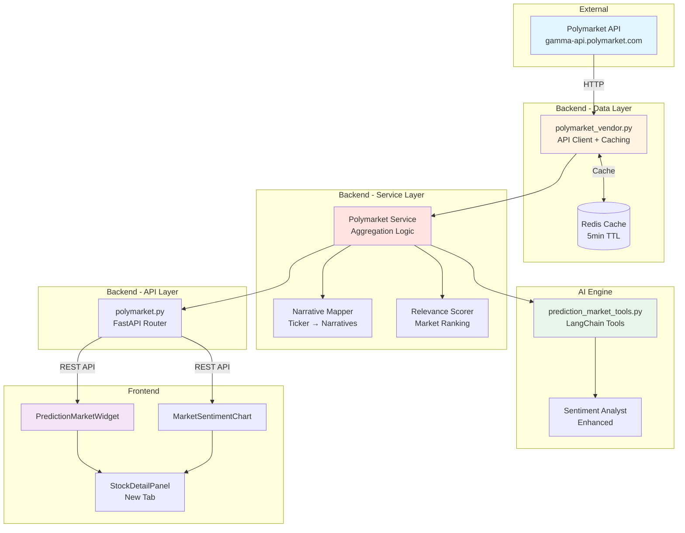
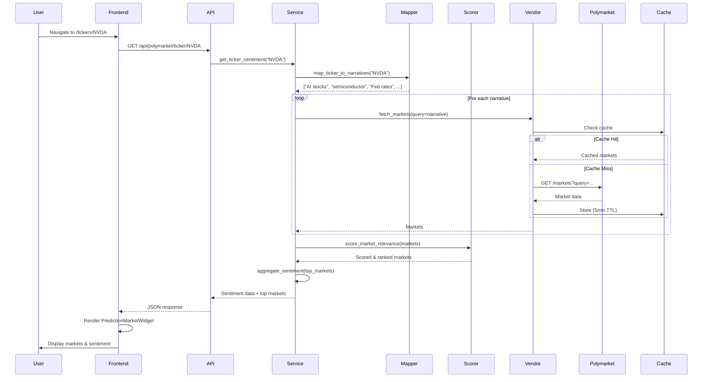
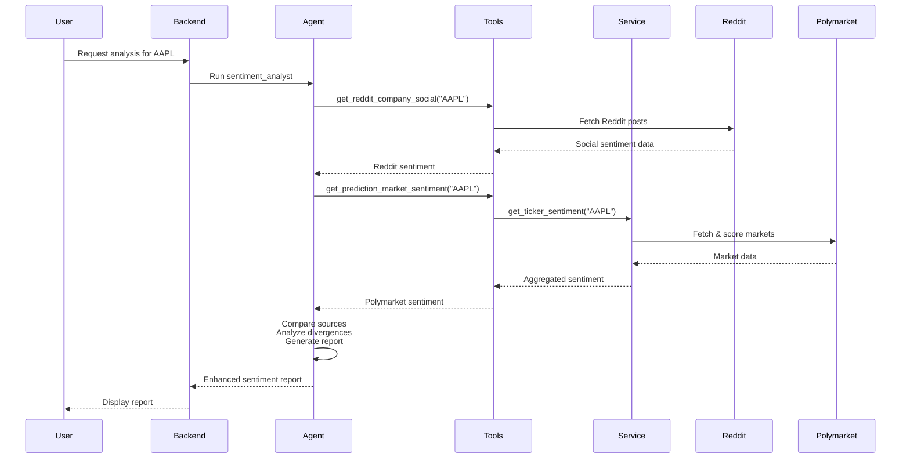

# Polymarket Technical Design Document

## System Architecture

### High-Level Component Diagram



## Data Flow Sequence

### Scenario: User Views NVDA Stock Page



### Scenario: AI Agent Generates Sentiment Report



## Core Algorithms

### 1. Narrative Mapping Algorithm

```python
def map_ticker_to_narratives(ticker: str, company_info: Dict) -> List[str]:
    """
    Generate search queries for Polymarket based on ticker context.
    
    Strategy:
    1. Direct company mentions (ticker, company name)
    2. Sector-specific narratives
    3. Macro economic drivers
    4. Related events (earnings, product launches)
    """
    
    narratives = []
    
    # 1. Direct mentions
    narratives.extend([
        ticker,
        company_info['name'],
        f"{ticker} stock",
        f"{ticker} earnings"
    ])
    
    # 2. Sector narratives
    sector = company_info.get('sector', '')
    if sector == 'Technology':
        narratives.extend([
            'AI stocks',
            'tech sector',
            'semiconductor',
            'cloud computing'
        ])
    elif sector == 'Energy':
        narratives.extend([
            'oil prices',
            'renewable energy',
            'EV adoption'
        ])
    # ... more sectors
    
    # 3. Macro drivers (always relevant)
    narratives.extend([
        'Fed rate decision',
        'interest rates',
        'recession probability',
        'inflation'
    ])
    
    # 4. Deduplicate and prioritize
    return list(dict.fromkeys(narratives))  # Preserve order
```

### 2. Market Relevance Scoring

```python
def score_market_relevance(
    market: Dict,
    ticker: str,
    narratives: List[str],
    company_info: Dict
) -> float:
    """
    Multi-factor relevance scoring (0-1 scale).
    
    Factors:
    - Keyword match: 0-0.3
    - Narrative alignment: 0-0.3
    - Liquidity: 0-0.2
    - Time relevance: 0-0.1
    - Resolution clarity: 0-0.1
    """
    
    score = 0.0
    question = market['question'].lower()
    description = market.get('description', '').lower()
    combined_text = f"{question} {description}"
    
    # 1. Keyword matching (0-0.3)
    keyword_score = 0.0
    if ticker.lower() in combined_text:
        keyword_score = 0.3
    elif company_info['name'].lower() in combined_text:
        keyword_score = 0.25
    elif any(word in combined_text for word in [ticker.lower(), company_info['name'].lower()]):
        keyword_score = 0.15
    score += keyword_score
    
    # 2. Narrative alignment (0-0.3)
    narrative_matches = sum(
        1 for narrative in narratives
        if narrative.lower() in combined_text
    )
    narrative_score = min(narrative_matches * 0.1, 0.3)
    score += narrative_score
    
    # 3. Liquidity weight (0-0.2)
    volume = market.get('volume', 0)
    liquidity = market.get('liquidity', 0)
    if volume >= 100000:
        liquidity_score = 0.2
    elif volume >= 10000:
        liquidity_score = 0.15
    elif volume >= 1000:
        liquidity_score = 0.1
    else:
        liquidity_score = 0.05
    score += liquidity_score
    
    # 4. Time relevance (0-0.1)
    end_date = datetime.fromisoformat(market['end_date'])
    days_until_resolution = (end_date - datetime.now()).days
    if 0 < days_until_resolution <= 30:
        time_score = 0.1
    elif 30 < days_until_resolution <= 90:
        time_score = 0.07
    elif 90 < days_until_resolution <= 180:
        time_score = 0.05
    else:
        time_score = 0.02
    score += time_score
    
    # 5. Resolution clarity (0-0.1)
    # Markets with clear, measurable outcomes score higher
    clarity_keywords = ['price', 'above', 'below', 'reach', 'beat', 'miss']
    if any(keyword in question for keyword in clarity_keywords):
        score += 0.1
    else:
        score += 0.05
    
    return min(score, 1.0)
```

### 3. Sentiment Aggregation

```python
def aggregate_sentiment(markets: List[Dict]) -> Dict:
    """
    Aggregate sentiment from multiple markets.
    
    Returns:
    {
        "overall_sentiment": 0.68,  # 0-1 scale
        "confidence": 0.85,  # Based on volume
        "trend": "bullish",  # bullish/neutral/bearish
        "narratives": {...}
    }
    """
    
    if not markets:
        return {
            "overall_sentiment": 0.5,
            "confidence": 0.0,
            "trend": "neutral",
            "narratives": {}
        }
    
    # Weight by volume and relevance
    total_weight = 0
    weighted_sum = 0
    
    for market in markets:
        weight = (
            math.log10(market['volume'] + 1) *
            market['relevance_score'] *
            time_decay_factor(market['end_date'])
        )
        
        # Probability represents bullish sentiment
        probability = market['probability']
        weighted_sum += probability * weight
        total_weight += weight
    
    overall_sentiment = weighted_sum / total_weight if total_weight > 0 else 0.5
    
    # Calculate confidence based on total volume
    total_volume = sum(m['volume'] for m in markets)
    confidence = min(math.log10(total_volume + 1) / 6, 1.0)  # Normalize to 0-1
    
    # Determine trend
    if overall_sentiment >= 0.6:
        trend = "bullish"
    elif overall_sentiment <= 0.4:
        trend = "bearish"
    else:
        trend = "neutral"
    
    # Group by narrative
    narratives = {}
    for market in markets:
        narrative = market.get('narrative', 'general')
        if narrative not in narratives:
            narratives[narrative] = {
                "markets": [],
                "sentiment": 0,
                "confidence": 0
            }
        narratives[narrative]["markets"].append(market)
    
    # Aggregate each narrative
    for narrative, data in narratives.items():
        narrative_sentiment = aggregate_sentiment(data["markets"])
        narratives[narrative]["sentiment"] = narrative_sentiment["overall_sentiment"]
        narratives[narrative]["confidence"] = narrative_sentiment["confidence"]
    
    return {
        "overall_sentiment": overall_sentiment,
        "confidence": confidence,
        "trend": trend,
        "narratives": narratives
    }

def time_decay_factor(end_date: str) -> float:
    """
    Apply time decay to market weight.
    Near-term markets are more relevant.
    """
    end = datetime.fromisoformat(end_date)
    days_until = (end - datetime.now()).days
    
    if days_until <= 0:
        return 0.1  # Resolved markets have low weight
    elif days_until <= 30:
        return 1.0  # Near-term: full weight
    elif days_until <= 90:
        return 0.8  # Medium-term: 80% weight
    elif days_until <= 180:
        return 0.6  # Long-term: 60% weight
    else:
        return 0.4  # Very long-term: 40% weight
```

## API Specifications

### Backend REST API

#### 1. Get Ticker Predictions

```
GET /api/polymarket/ticker/{ticker}
```

**Response**:
```json
{
  "ticker": "NVDA",
  "overall_sentiment": 0.72,
  "confidence": 0.88,
  "trend": "bullish",
  "last_updated": "2026-03-28T14:00:00Z",
  "narratives": {
    "ai_momentum": {
      "sentiment": 0.78,
      "confidence": 0.92,
      "market_count": 5
    },
    "macro_liquidity": {
      "sentiment": 0.52,
      "confidence": 0.75,
      "market_count": 3
    }
  },
  "top_markets": [
    {
      "id": "0x123...",
      "question": "Will AI stocks outperform S&P 500 in Q2 2026?",
      "probability": 0.78,
      "change_24h": 0.03,
      "volume": 125000,
      "liquidity": 45000,
      "end_date": "2026-06-30T23:59:59Z",
      "narrative": "ai_momentum",
      "url": "https://polymarket.com/event/...",
      "relevance_score": 0.85
    }
  ]
}
```

#### 2. Get Trending Markets

```
GET /api/polymarket/markets/trending?category=finance&limit=20
```

**Response**:
```json
{
  "markets": [
    {
      "id": "0x123...",
      "question": "Will Fed cut rates in June 2026?",
      "probability": 0.65,
      "volume_24h": 250000,
      "total_volume": 1500000,
      "category": "finance",
      "end_date": "2026-06-15T23:59:59Z"
    }
  ]
}
```

#### 3. Get Market Details

```
GET /api/polymarket/market/{market_id}
```

**Response**:
```json
{
  "id": "0x123...",
  "question": "Will NVDA reach $1000 by end of Q2 2026?",
  "description": "Resolves YES if NVDA closes above $1000...",
  "probability": 0.45,
  "outcomes": [
    {"name": "Yes", "price": 0.45, "shares": 125000},
    {"name": "No", "price": 0.55, "shares": 135000}
  ],
  "volume": 85000,
  "liquidity": 32000,
  "created_date": "2026-01-15T10:00:00Z",
  "end_date": "2026-06-30T23:59:59Z",
  "resolution_source": "Yahoo Finance",
  "category": "finance",
  "tags": ["stocks", "nvidia", "tech"]
}
```

#### 4. Get Market History

```
GET /api/polymarket/market/{market_id}/history?days=30
```

**Response**:
```json
{
  "market_id": "0x123...",
  "history": [
    {
      "timestamp": "2026-03-28T00:00:00Z",
      "probability": 0.45,
      "volume_24h": 12000
    },
    {
      "timestamp": "2026-03-27T00:00:00Z",
      "probability": 0.42,
      "volume_24h": 8500
    }
  ]
}
```

### AI Agent Tool Specifications

#### Tool 1: get_prediction_market_sentiment

```python
@tool
def get_prediction_market_sentiment(
    ticker: str,
    date: str
) -> str:
    """
    Get prediction market sentiment for a stock ticker.
    
    Args:
        ticker: Stock ticker symbol (e.g., "AAPL")
        date: Current date in YYYY-MM-DD format
    
    Returns:
        Formatted string with:
        - Overall sentiment score (0-1)
        - Confidence level
        - Top relevant markets with probabilities
        - Narrative breakdown
        - Key insights
    """
```

**Example Output**:
```
Polymarket Sentiment for NVDA (2026-03-28)

Overall Sentiment: 0.72 (Bullish)
Confidence: 88% (High volume backing)

Narrative Breakdown:
1. AI Momentum (78% bullish, 92% confidence)
   - "Will AI stocks outperform S&P 500 in Q2?" → 78%
   - "Will Nvidia maintain AI chip leadership?" → 82%

2. Macro Liquidity (52% neutral, 75% confidence)
   - "Will Fed cut rates before July?" → 52%
   - "Will tech stocks benefit from rate cuts?" → 55%

Key Insights:
- Strong conviction in AI sector momentum
- Moderate uncertainty around macro conditions
- High trading volume indicates active market interest
```

#### Tool 2: get_market_implied_probabilities

```python
@tool
def get_market_implied_probabilities(
    event_type: str,
    ticker: Optional[str] = None
) -> str:
    """
    Get market-implied probabilities for specific event types.
    
    Args:
        event_type: One of ['fed_rate', 'recession', 'earnings', 
                           'price_target', 'sector']
        ticker: Optional ticker for company-specific events
    
    Returns:
        Formatted string with relevant market probabilities
    """
```

## Database Schema

### Polymarket Cache Table (Optional)

```sql
CREATE TABLE polymarket_markets (
    id VARCHAR(66) PRIMARY KEY,  -- Ethereum address
    question TEXT NOT NULL,
    description TEXT,
    probability DECIMAL(5,4),
    volume BIGINT,
    liquidity BIGINT,
    end_date TIMESTAMP,
    category VARCHAR(50),
    tags TEXT[],
    created_at TIMESTAMP DEFAULT NOW(),
    updated_at TIMESTAMP DEFAULT NOW(),
    
    INDEX idx_category (category),
    INDEX idx_end_date (end_date),
    INDEX idx_volume (volume DESC)
);

CREATE TABLE polymarket_ticker_mappings (
    ticker VARCHAR(10),
    market_id VARCHAR(66),
    relevance_score DECIMAL(3,2),
    narrative VARCHAR(50),
    created_at TIMESTAMP DEFAULT NOW(),
    
    PRIMARY KEY (ticker, market_id),
    FOREIGN KEY (market_id) REFERENCES polymarket_markets(id),
    INDEX idx_ticker_relevance (ticker, relevance_score DESC)
);
```

## Error Handling Strategy

### 1. API Failures

```python
class PolymarketAPIError(Exception):
    """Base exception for Polymarket API errors."""
    pass

class PolymarketRateLimitError(PolymarketAPIError):
    """Rate limit exceeded."""
    pass

class PolymarketUnavailableError(PolymarketAPIError):
    """API temporarily unavailable."""
    pass

def fetch_with_retry(url: str, max_retries: int = 3) -> Dict:
    """Fetch with exponential backoff."""
    for attempt in range(max_retries):
        try:
            response = requests.get(url, timeout=10)
            response.raise_for_status()
            return response.json()
        except requests.exceptions.Timeout:
            if attempt == max_retries - 1:
                raise PolymarketUnavailableError("API timeout")
            time.sleep(2 ** attempt)
        except requests.exceptions.HTTPError as e:
            if e.response.status_code == 429:
                raise PolymarketRateLimitError("Rate limit exceeded")
            raise PolymarketAPIError(f"HTTP error: {e}")
```

### 2. Graceful Degradation

```python
def get_ticker_sentiment_safe(ticker: str) -> Dict:
    """
    Get sentiment with fallback to cached/default data.
    """
    try:
        return get_ticker_sentiment(ticker)
    except PolymarketUnavailableError:
        # Try cache
        cached = get_from_cache(f"polymarket:{ticker}")
        if cached:
            logger.warning(f"Using cached Polymarket data for {ticker}")
            return cached
        
        # Return neutral default
        logger.error(f"Polymarket unavailable for {ticker}, using default")
        return {
            "overall_sentiment": 0.5,
            "confidence": 0.0,
            "trend": "neutral",
            "error": "Data temporarily unavailable"
        }
```

## Performance Optimization

### 1. Caching Strategy

```python
# Multi-layer cache
CACHE_CONFIG = {
    "market_prices": {
        "ttl": 300,  # 5 minutes
        "layer": "redis"
    },
    "market_list": {
        "ttl": 3600,  # 1 hour
        "layer": "redis"
    },
    "ticker_mappings": {
        "ttl": 86400,  # 24 hours
        "layer": "database"
    }
}
```

### 2. Batch Processing

```python
async def fetch_markets_batch(narratives: List[str]) -> List[Dict]:
    """Fetch markets for multiple narratives concurrently."""
    async with aiohttp.ClientSession() as session:
        tasks = [
            fetch_markets_async(session, narrative)
            for narrative in narratives
        ]
        results = await asyncio.gather(*tasks, return_exceptions=True)
        
        # Filter out errors
        return [r for r in results if not isinstance(r, Exception)]
```

### 3. Query Optimization

```python
def optimize_narrative_queries(narratives: List[str]) -> List[str]:
    """
    Reduce redundant queries.
    
    - Deduplicate similar queries
    - Combine related terms
    - Prioritize high-value narratives
    """
    # Remove duplicates while preserving order
    unique = list(dict.fromkeys(narratives))
    
    # Combine similar queries
    combined = []
    for query in unique:
        if not any(query in existing for existing in combined):
            combined.append(query)
    
    # Limit to top 10 most relevant
    return combined[:10]
```

## Security Considerations

1. **No API Keys Required**: Polymarket public API doesn't require authentication
2. **Rate Limiting**: Implement client-side rate limiting to avoid abuse
3. **Input Validation**: Sanitize ticker symbols and query parameters
4. **CORS Configuration**: Restrict API access to frontend domain
5. **Data Sanitization**: Validate all API responses before processing

## Monitoring & Logging

```python
# Metrics to track
METRICS = {
    "polymarket_api_calls": Counter,
    "polymarket_api_latency": Histogram,
    "polymarket_cache_hits": Counter,
    "polymarket_cache_misses": Counter,
    "polymarket_errors": Counter,
}

# Logging
logger.info(
    "Polymarket sentiment fetched",
    extra={
        "ticker": ticker,
        "sentiment": sentiment,
        "confidence": confidence,
        "market_count": len(markets),
        "latency_ms": latency
    }
)
```

## Deployment Checklist

- [ ] Environment variables configured
- [ ] Redis cache available
- [ ] API endpoints tested
- [ ] Frontend components deployed
- [ ] AI agent tools registered
- [ ] Error handling verified
- [ ] Monitoring dashboards created
- [ ] Documentation updated
- [ ] User guide written
- [ ] Feature flag enabled