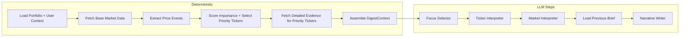

# User Daily Brief Workflow for FlowDeck (Event-Layer Redesign)

## 1. Architecture

- **Design principle:** keep all deterministic data preparation outside the LLM pipeline, and make the "what happened" layer explicit rather than implicit.
- **Core change:** split the current single algorithmic preparation stage into:
  1. **Base Data Collection**
  2. **Deterministic Event Extraction**
  3. **Priority Scoring / Context Assembly**
- **Why:** today the brief mostly infers importance from returns, news presence, and LLM summarization. The redesigned flow introduces a first-class event layer so the pipeline can say, deterministically, which meaningful price/volume/technical events occurred for each ticker.
- **Long-term direction:** the event layer becomes a common interface across domains:
  - price/technical events
  - news/information events
  - fundamental events



The event layer is deterministic and explainable. Agents consume it as prepared evidence; they do not decide whether the event happened.
The narrative stage can also consume the user's most recently stored brief so the generated report emphasizes what is new or materially changed instead of repeating unchanged observations.

---

## 2. New Concept: Event Extraction Layer

### 2.1 Goals

- Convert raw time series into explicit event objects.
- Make event detection reproducible and testable.
- Give downstream steps a stronger notion of "importance" than plain return magnitude.
- Create a schema that can later support news and fundamentals without redesigning the pipeline again.

### 2.2 Event domains

The system should treat all events through one shared abstraction:

- `price_technical`
- `news_information`
- `fundamental`

The first implementation only populates `price_technical`. The others are reserved for future expansion.

### 2.3 Event taxonomy for phase 1

Initial deterministic price/technical events per ticker:

- `price_spike_up`
- `price_spike_down`
- `price_gap_up`
- `price_gap_down`
- `volatility_expansion`
- `volatility_compression`
- `trend_acceleration`
- `trend_reversal`
- `support_break`
- `resistance_break`
- `moving_average_cross`
- `new_52w_high`
- `new_52w_low`
- `volume_spike`
- `unusual_volume_pattern`

Future domains can add:

- `news_published`
- `breaking_news`
- `major_headline`
- `earnings_announced`
- `earnings_upcoming`
- `guidance_change`
- `analyst_upgrade`
- `analyst_downgrade`
- `dividend_declared`
- `buyback_announced`

---

## 3. State Model Redesign

### 3.1 New event models

Define new Pydantic models in `ai_engine/briefing_agent/state.py`.

```python
EventDomain = Literal["price_technical", "news_information", "fundamental"]
EventDirection = Literal["bullish", "bearish", "neutral", "mixed"]
EventStrength = Literal["low", "medium", "high"]


class DetectedEvent(BaseModel):
    event_type: str
    domain: EventDomain
    direction: EventDirection
    strength: EventStrength
    summary: str
    detected_on: Optional[str] = None
    window_start: Optional[str] = None
    window_end: Optional[str] = None
    metric_value: Optional[float] = None
    threshold_value: Optional[float] = None
    metadata: Dict[str, Any] = Field(default_factory=dict)


class TickerEventSummary(BaseModel):
    ticker: str
    events: List[DetectedEvent] = Field(default_factory=list)
    event_score: float = 0.0
    dominant_events: List[str] = Field(default_factory=list)
    bullish_event_count: int = 0
    bearish_event_count: int = 0
    neutral_event_count: int = 0
```

### 3.2 DigestContext additions

Extend `DigestContext` with:

- `ohlcv_history: Dict[str, list[dict]]`
  - recent daily bars used for event extraction; enough for audits and prompt grounding
- `event_summaries: Dict[str, TickerEventSummary]`
  - canonical per-ticker event output
- `event_scores: Dict[str, float]`
  - flattened lookup used by ranking
- `market_events: List[DetectedEvent]`
  - reserved for future deterministic market-wide event extraction

### 3.3 Why keep both `event_summaries` and `event_scores`

- `event_summaries` is for interpretation and explanation.
- `event_scores` is for deterministic ranking.
- This separation avoids re-deriving ranking logic from free-form event lists in later stages.

---

## 4. Workflow Redesign

## 4.1 Revised deterministic pipeline

### Step 1: Load portfolio and user context

- Load subscribed tickers.
- Load saved user profile / AI memory.
- If no portfolio, still build market context as today.

### Step 2: Fetch base market data

For all portfolio tickers:

- quote snapshot
- daily OHLCV history
- enough history for:
  - 1d / 5d / span returns
  - moving averages
  - volatility windows
  - 52-week range checks
  - volume baselines
  - support / resistance lookbacks

Minimum recommended history:

- 252 trading days for full event coverage
- if less is available, compute the subset of events that remain valid

### Step 3: Deterministic event extraction

Run a dedicated event extractor on every ticker's OHLCV history.

**Function:**

`extract_price_events(ticker, bars, quote, span_type, start_date, end_date) -> TickerEventSummary`

This stage should:

- calculate derived indicators once
- detect events using deterministic rules
- emit normalized event objects
- compute a deterministic `event_score`

### Step 4: Priority scoring

Replace the current mostly return-based ranking with a combined score:

`attention_score = f(event_score, return_magnitude, recent_news_presence, abnormal_move, user_focus_override)`

Recommended shape:

- event score becomes the primary signal
- raw return magnitude remains secondary
- recent news remains a weak additive signal
- user-selected focus still overrides ranking

### Step 5: Fetch deeper evidence for priority tickers

After priority tickers are selected:

- ticker news
- fundamentals
- analyst recommendations
- insider transactions
- platform reports
- sector / peer context

This keeps the expensive enrichment limited to names that already look important.

### Step 6: Assemble `DigestContext`

The LLM-facing context should now include:

- raw price/return context
- extracted deterministic events
- event summaries and event score
- all current evidence sources

---

## 5. Deterministic Event Definitions

These definitions should live in a dedicated module such as:

- `ai_engine/briefing_agent/event_extractor.py`

The exact thresholds can be tuned later, but the interface should be stable.

### 5.1 Price movement events

#### `price_spike_up` / `price_spike_down`

Detect when the latest close-to-close return is unusually large relative to recent realized volatility.

Candidate rule:

- compute latest daily return
- compute rolling 20-day std dev of daily returns
- trigger if absolute return >= `max(4%, 2.0 * rolling_std)`
- map sign to up/down

#### `price_gap_up` / `price_gap_down`

Detect when today's open materially differs from the previous close.

Candidate rule:

- gap % = `(today_open - prev_close) / prev_close * 100`
- trigger if absolute gap >= `max(2%, 1.5 * avg_abs_gap_20d)`

### 5.2 Volatility regime events

#### `volatility_expansion`

- rolling 10-day realized vol / rolling 60-day realized vol >= 1.5

#### `volatility_compression`

- rolling 10-day realized vol / rolling 60-day realized vol <= 0.67

### 5.3 Trend events

#### `trend_acceleration`

Detect strengthening trend rather than just positive return.

Candidate rule:

- 10-day EMA slope and 20-day EMA slope align
- short slope magnitude is meaningfully larger than medium slope magnitude
- price is above 20-day EMA for bullish acceleration or below for bearish acceleration

#### `trend_reversal`

Candidate rule:

- recent direction over prior window differs from current short window
- short EMA crosses opposite side of medium EMA
- latest close confirms reversal by remaining beyond crossover level

### 5.4 Structure events

#### `support_break`

- latest close breaks below rolling N-day support level by a buffer
- example: close < lowest low of prior 20 days by 0.5%

#### `resistance_break`

- latest close breaks above rolling N-day resistance level by a buffer
- example: close > highest high of prior 20 days by 0.5%

#### `moving_average_cross`

- detect short/medium MA crossover
- metadata should record which pair crossed, for example `10_over_20_bullish`

### 5.5 Range events

#### `new_52w_high`

- latest high >= max high over prior 252 bars

#### `new_52w_low`

- latest low <= min low over prior 252 bars

### 5.6 Volume events

#### `volume_spike`

- latest volume / rolling 20-day avg volume >= 2.0

#### `unusual_volume_pattern`

Use this for deterministic but less directional patterns, for example:

- multi-day elevated volume without equally large price move
- high volume on reversal day
- rising volume into breakout/breakdown sequence

This event should carry richer metadata because the label alone is broad.

---

## 6. Event Scoring

The extractor should compute a deterministic `event_score` per ticker.

### 6.1 Why score events

- ranking needs one scalar
- multiple events can co-exist
- not all events should matter equally

### 6.2 Recommended scoring structure

Each event contributes:

- base weight by event type
- multiplier by strength
- optional recency bonus

Example weights:

- high-importance structure/range breaks:
  - `support_break`, `resistance_break`, `new_52w_high`, `new_52w_low`: high
- medium-importance:
  - `price_spike_*`, `price_gap_*`, `trend_reversal`, `moving_average_cross`, `volume_spike`
- lower-importance contextual regime shifts:
  - `volatility_expansion`, `volatility_compression`, `trend_acceleration`, `unusual_volume_pattern`

Example:

`event_score = sum(event_weight * strength_multiplier * recency_multiplier)`

This should remain deterministic and auditable.

---

## 7. Agent Redesign

The agents remain in the same order, but their inputs become more explicit.

### 7.1 Focus Selector

Current role:

- choose focus tickers from ranked portfolio names

New role:

- start from `event_score` and `attention_score`
- prefer names with multiple high-signal events
- still allow user note / explicit focus tickers to override

Prompt should include:

- event score
- dominant events
- concise event summaries

### 7.2 Ticker Interpreter

Current issue:

- it infers what happened mainly from mixed raw data blobs

New role:

- explain the deterministic event set first
- connect those events to news/fundamentals/reports
- decide whether the event appears company-, sector-, or macro-driven

Prompt should explicitly separate:

- deterministic price events
- supporting news/fundamental evidence
- prior FlowDeck thesis

The interpreter should not decide whether `support_break` happened. It should decide what it means.

### 7.3 Market Interpreter

No structural change, but it should receive:

- aggregate counts of notable ticker events across the portfolio
- optional market-level event summaries in the future

This lets the market step talk about internal breadth of portfolio risk, for example:

- multiple support breaks
- several new highs
- widespread volatility expansion

### 7.4 Narrative Writer

The writer should consume:

- market interpretation
- ticker interpretations
- dominant events per ticker
- the most recently stored prior brief for the user, when one exists

This should improve output quality because the writer can ground the brief in explicit event language:

- "AAPL triggered a resistance break on elevated volume"
- "MSFT showed volatility compression ahead of earnings"

The previous brief should be treated as continuity context, not as a template to paraphrase. The writer should:

- avoid repeating unchanged observations from the prior brief
- focus on newly emerged events, changed implications, or materially updated risks
- only restate an older point when it is still the most important thing for the user to monitor, and then do so with fresh context

The writer should still decide presentation, not detection.

---

## 8. File Layout

Recommended structure:

- `ai_engine/briefing_agent/state.py`
  - add event models and event fields on `DigestContext`
- `ai_engine/briefing_agent/event_extractor.py`
  - deterministic event definitions and extraction logic
- `ai_engine/briefing_agent/context_builder.py`
  - fetch OHLCV, call extractor, score events, rank tickers, assemble context
- `ai_engine/briefing_agent/runner.py`
  - load the most recently stored previous brief and attach it to workflow state for continuity
- `ai_engine/briefing_agent/agents.py`
  - format event summaries and previous-brief context into prompts for Focus Selector / Ticker Interpreter / Market Interpreter / Writer
- `ai_engine/briefing_agent/prompts.py`
  - update prompts to treat deterministic events as canonical evidence and instruct the writer not to repeat stale points from the last brief

---

## 9. Testing Strategy

### 9.1 Unit tests for event extraction

Add focused tests for each event family using synthetic OHLCV fixtures:

- spike up/down
- gap up/down
- volatility expansion/compression
- trend acceleration/reversal
- support/resistance break
- moving average cross
- new 52-week high/low
- volume spike
- unusual volume pattern

### 9.2 Context builder tests

Verify:

- event summaries appear in `DigestContext`
- event score influences ranking
- fallback still works when history is missing
- portfolio-empty flow still works

### 9.3 Prompt-shape tests

Verify the prompts include:

- dominant events
- event score or event summary
- separation between deterministic events and interpretive reasoning
- previous-brief continuity instructions and anti-repetition guidance

---

## 10. Migration Path

Recommended implementation order:

1. Add state models for events.
2. Add `event_extractor.py` with price/technical events only.
3. Store event summaries in `DigestContext`.
4. Change ranking to incorporate `event_score`.
5. Update prompt formatting so agents receive event summaries.
6. Add tests for synthetic price patterns.
7. Later extend the same event schema to news and fundamentals.

This keeps the redesign incremental while preserving the rest of the brief pipeline.

---

## 11. Summary

- The major redesign is to promote "events" to a first-class deterministic layer.
- Raw OHLCV is transformed into explicit price/technical events before ranking or interpretation.
- Ranking becomes event-driven rather than mostly return-driven.
- Agents stop inferring detection and instead interpret precomputed events.
- The same event abstraction can later support news and fundamentals without another architectural rewrite.
