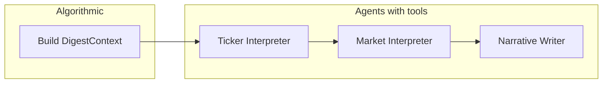

# User Daily Brief Workflow for FlowDeck (Agentic-Oriented)

## 1. Architecture

- **Design principle:** All consecutive deterministic work is **squashed into one algorithmic step**. The workflow is **agent-centric**: each agent receives prepared data, has a clear task, and has **tools** to pull more information when the prepared context is insufficient.
- **New module:** `ai_engine/daily_digest/` containing:
  - **State models:** Workflow state + **DigestContext** (output of the single algorithmic step; the primary input to agents).
- **One algorithmic step:** A single function that loads portfolio, fetches base market data, ranks tickers, fetches detailed evidence, platform reports, market context, and sector/peer context. Output = **DigestContext**.
- **Three AI agents:** Each gets the relevant slice of state (DigestContext + prior agents' outputs), has a **bounded tool set**, and can call tools to get information **beyond** what was passed in.
- **Orchestration:** Linear pipeline: `build_digest_context(...)` → Ticker Interpreter(s) → Market Interpreter → Narrative Writer. Runner can be wrapped in LangGraph or a cron job later.

**Data sources:** Used inside the algorithmic step and exposed to agents via their tools: portfolio from `ai_engine/agent/tools/user_context.py` (Subscription); quotes, history, news, fundamentals, analyst/insider, market movers from `backend/services/cached_info_fetcher.py` and `backend/services/info_fetcher.py`; platform reports from `backend/services/report_service.py`; web search from `ai_engine/agent/tools/web_search.py`.

---

## 2. State Models

**DigestContext (output of the single algorithmic step)**  
This is the main data structure that agents receive. Define it as a Pydantic model with:

- **Portfolio:** `tickers: list[str]`, optional `user_context_snapshot: str | None`.
- **Priority:** `priority_tickers: list[str]`, `attention_scores: dict[str, float]`.
- **Per-ticker (for priority_tickers only):** `quotes`, `returns_1d`, `returns_5d`, `abnormal_signal`; `news`, `fundamentals`, `analyst_rec`, `insider`, `indicators`; `platform_reports`; `sector_industry`, `peer_tickers`, `peer_quotes`. Missing ticker/key → empty or None; agents use **tools** to fill gaps when needed.
- **Market:** `market_movers`, `global_news`, optional `web_search_snippet`.

**Workflow state (passed along the pipeline):** Input (`user_id`, `digest_date`, `max_priority_tickers`, `db`, `config`); after algorithmic step: `digest_context: DigestContext`; after agents: `ticker_interpretations`, `market_interpretation`, `digest_narrative`, `what_to_watch`.

**Typed interpretations (agent outputs):**

- `TickerInterpretation`: `explanation: str`, `driver: Literal["company", "sector", "macro", "unclear"]`, `thesis_comparison: str`.
- `MarketInterpretation`: `summary: str`, `relevance_to_portfolio: str`.

Define all in `ai_engine/daily_digest/state.py`.

---

## 3. Workflow Design: One Algorithmic Step + Three Agents

### 3.1 Algorithmic step (single function)

**Function:** `build_digest_context(user_id, digest_date, max_priority_tickers, db, fetchers)` → `DigestContext`.

**Internal sequence (all deterministic, no LLM):**

1. Load portfolio tickers from `Subscription` by `user_id`; optionally `get_user_context`. If no tickers, return a minimal context or short-circuit the workflow with a "no portfolio" brief.
2. Fetch base market data for all portfolio tickers: `get_quotes_batch`, `get_historical` per ticker; compute 1d/5d returns and a simple abnormal-move signal (e.g. |1d return| > 2× recent vol or ±3%).
3. Rank tickers: lightweight `get_news_batch(tickers, lookback_days=2)` for has_recent_news; score = f(|returns_1d|, |returns_5d|, abnormal_flag, has_recent_news); sort and take top `max_priority_tickers`.
4. For priority tickers only: fetch news (e.g. 5–7 days), fundamentals/company info (sector/industry), analyst recommendations, insider transactions/sentiment, technical indicators; fetch platform reports via `ReportService.get_latest_analysis_run` + `get_reports_with_scores` (or batch API).
5. Fetch market context: `get_daily_market_movers`, `get_global_news`; optionally one `web_search` for macro/sector and store a short snippet.
6. Build sector/peer context: from company info get sector/industry per priority ticker; deterministic peer set (e.g. same sector from portfolio + market movers); `get_quotes_batch(peer_tickers)` for peer moves.

On partial failure (e.g. missing data for one ticker), set that key to empty/None and continue. Output is one **DigestContext** instance.

### 3.2 Agent 1 – Ticker Interpreter

- **Data it gets:** For each priority ticker, the slice of `DigestContext` for that ticker: quote, returns, abnormal flag, news, fundamentals, analyst rec, insider, indicators, platform reports (thesis/key takeaways), sector/industry, peer tickers and their moves. Passed in the agent prompt.
- **Task:** Explain what happened for this ticker; classify driver (company-specific / sector-wide / macro-driven / unclear); compare today's developments to the latest FlowDeck thesis from platform reports.
- **Output:** `TickerInterpretation` (explanation, driver, thesis_comparison) per ticker. Use structured output (Pydantic/JSON).
- **Tools (to get information beyond the provided input):** `get_news(ticker)`, `get_platform_reports(ticker)`, `get_fundamentals(ticker)`, `get_analysts_recommendation(ticker)`, `get_insider_transactions(ticker)`, `get_insider_sentiment(ticker)`, `get_indicators(ticker)`, `web_search(query)`. The agent can call these when the prepared context is missing a piece or when it wants to verify or deepen (e.g. latest headline, full report text, or a macro query).

### 3.3 Agent 2 – Market Interpreter

- **Data it gets:** `DigestContext.market_movers`, `global_news`, `web_search_snippet`; list of portfolio tickers and priority tickers; optionally a one-line summary per priority ticker from the Ticker Interpreter.
- **Task:** Summarize the overall market backdrop; explain why it matters for this portfolio.
- **Output:** `MarketInterpretation` (summary, relevance_to_portfolio). Structured output.
- **Tools:** `get_global_news(query)`, `get_daily_market_movers(count)`, `web_search(query)`. Use when it needs fresher or more targeted macro/sector/breaking context than what was pre-fetched.

### 3.4 Agent 3 – Narrative Writer

- **Data it gets:** All `ticker_interpretations` and `market_interpretation` (and optionally the raw DigestContext for reference).
- **Task:** Write a short, narrative, portfolio-centered digest; avoid long bullet lists. End with a short "what to watch" section.
- **Output:** `digest_narrative: str`, `what_to_watch: str` (or a single combined string).
- **Tools:** `get_ticker_quote(ticker)`, `get_platform_reports(ticker)`. Use when it needs an exact price or report date to cite in the narrative.

**Failure handling:** If the algorithmic step fails for a subset of tickers, leave those keys empty and continue. If an agent fails, let the exception propagate (per workspace rules). Optional: at API/job level, one try/except to return "brief unavailable" and log.

---

## 4. Specialized Agents: Data, Task, Tools (Summary)

| Agent | Data it gets | Task | Tools (beyond provided input) |
|-------|----------------|-----|------------------------------|
| **Ticker Interpreter** | Per-ticker slice of DigestContext (quote, returns, news, fundamentals, analyst, insider, indicators, platform reports, sector/peers) | Explain move; classify driver; compare to FlowDeck thesis | `get_news`, `get_platform_reports`, `get_fundamentals`, `get_analysts_recommendation`, `get_insider_transactions`, `get_insider_sentiment`, `get_indicators`, `web_search` |
| **Market Interpreter** | market_movers, global_news, web snippet; portfolio + priority tickers; optional one-liner per ticker | Summarize market backdrop; relevance to portfolio | `get_global_news`, `get_daily_market_movers`, `web_search` |
| **Narrative Writer** | All ticker_interpretations + market_interpretation | Short narrative digest + "what to watch" | `get_ticker_quote`, `get_platform_reports` |

**Implementation pattern:** Each agent is a node that receives state (DigestContext + prior outputs), has access only to its bounded tool set, and can invoke tools to fetch more data before producing its output. Use structured output (Pydantic/JSON) for interpretations. Prompts in `ai_engine/daily_digest/prompts.py`; reuse trading-agents LLM config.

---

## 5. File Layout and Integration

- `ai_engine/daily_digest/state.py` – DigestContext, workflow state, TickerInterpretation, MarketInterpretation (Pydantic).
- `ai_engine/daily_digest/context_builder.py` – Single function `build_digest_context(...)` (all deterministic logic: load portfolio → base data → rank → evidence → reports → market context → sector/peer).
- `ai_engine/daily_digest/agents.py` – Ticker Interpreter, Market Interpreter, Narrative Writer (each with bounded tools; each takes state, can call tools, returns updated state).
- `ai_engine/daily_digest/prompts.py` – Prompt templates for the three agents.
- `ai_engine/daily_digest/runner.py` – `run_digest(user_id, digest_date, db, config)` runs: build_digest_context → ticker interpreter(s) → market interpreter → narrative writer; returns final state or DigestResult.

**Integration:** API endpoint (e.g. `GET /api/digest`) or standalone script for cron; runner is a single callable for easy use inside a LangGraph node.

---

## 6. Testing and Logging

- **Unit test** the algorithmic step with mocked fetchers and 2–3 tickers; test ranking and peer mapping in isolation.
- **Integration test:** Run full pipeline with test user, 1–2 tickers, mock or cheap LLM; assert state shape and non-empty narrative/what_to_watch.
- **Logging:** Log at pipeline boundaries (e.g. "digest: context built, N priority tickers"; "ticker_interpreter for AAPL"; agent tool calls); do not swallow exceptions.

---

## 7. Summary

- **Architecture:** One algorithmic step produces **DigestContext**; three agents (Ticker Interpreter, Market Interpreter, Narrative Writer) consume it and use **tools** to get more information when needed.
- **State:** DigestContext + workflow state with interpretation fields; all typed in `state.py`.
- **Agents:** Designed around **what data they get** (from context + prior agents), **what they must do** (task), and **what tools they have** to fetch beyond the input.
- **Integration:** `run_digest(user_id, date, db, config)` suitable for API or cron; pluggable into LangGraph.
